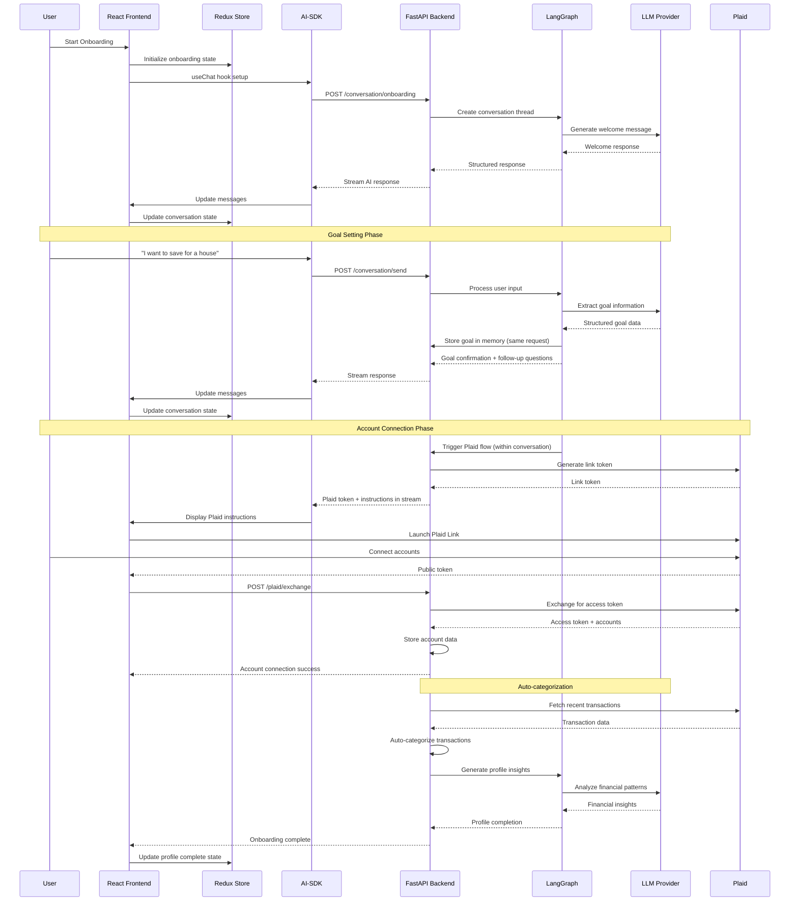
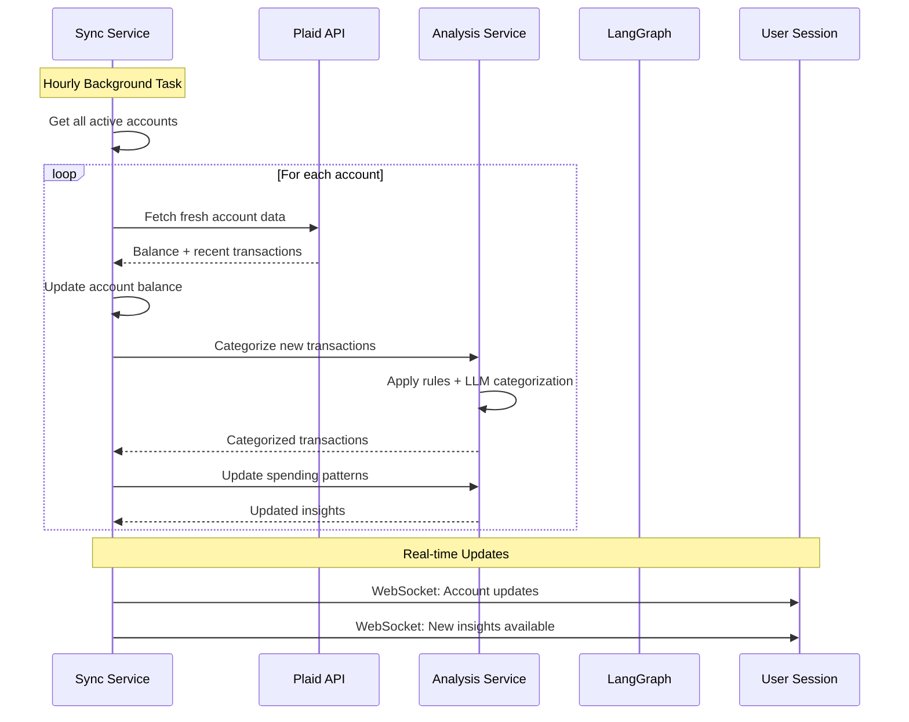

# Core Workflows

## AI Onboarding Conversation Flow

```mermaid
sequenceDiagram
    participant U as User
    participant F as React Frontend
    participant R as Redux Store
    participant A as AI-SDK
    participant B as FastAPI Backend
    participant L as LangGraph
    participant LLM as LLM Provider
    participant P as Plaid

    U->>F: Start Onboarding
    F->>R: Initialize onboarding state
    F->>A: useChat hook setup
    A->>B: POST /conversation/onboarding
    B->>L: Create conversation thread
    L->>LLM: Generate welcome message
    LLM-->>L: Welcome response
    L-->>B: Structured response
    B-->>A: Stream AI response
    A->>F: Update messages
    F->>R: Update conversation state
    
    Note over U,LLM: Goal Setting Phase
    U->>A: "I want to save for a house"
    A->>B: POST /conversation/send
    B->>L: Process user input
    L->>LLM: Extract goal information
    LLM-->>L: Structured goal data
    L->>B: Store goal in memory (same request)
    L-->>B: Goal confirmation + follow-up questions
    B-->>A: Stream response
    A->>F: Update messages
    F->>R: Update conversation state
    
    Note over U,P: Account Connection Phase
    L->>B: Trigger Plaid flow (within conversation)
    B->>P: Generate link token
    P-->>B: Link token
    B-->>A: Plaid token + instructions in stream
    A->>F: Display Plaid instructions
    F->>P: Launch Plaid Link
    U->>P: Connect accounts
    P-->>F: Public token
    F->>B: POST /plaid/exchange
    B->>P: Exchange for access token
    P-->>B: Access token + accounts
    B->>B: Store account data
    B-->>F: Account connection success
    
    Note over B,LLM: Auto-categorization
    B->>P: Fetch recent transactions
    P-->>B: Transaction data
    B->>B: Auto-categorize transactions
    B->>L: Generate profile insights
    L->>LLM: Analyze financial patterns
    LLM-->>L: Financial insights
    L-->>B: Profile completion
    B-->>F: Onboarding complete
    F->>R: Update profile complete state
```

## Periodic Data Synchronization

```mermaid
sequenceDiagram
    participant S as Sync Service
    participant P as Plaid API
    participant A as Analysis Service
    participant L as LangGraph
    participant U as User Session

    Note over S: Hourly Background Task
    S->>S: Get all active accounts
    loop For each account
        S->>P: Fetch fresh account data
        P-->>S: Balance + recent transactions
        S->>S: Update account balance
        S->>A: Categorize new transactions
        A->>A: Apply rules + LLM categorization
        A-->>S: Categorized transactions
        S->>A: Update spending patterns
        A-->>S: Updated insights
    end
    
    Note over S,U: Real-time Updates
    S->>U: WebSocket: Account updates
    S->>U: WebSocket: New insights available
```
