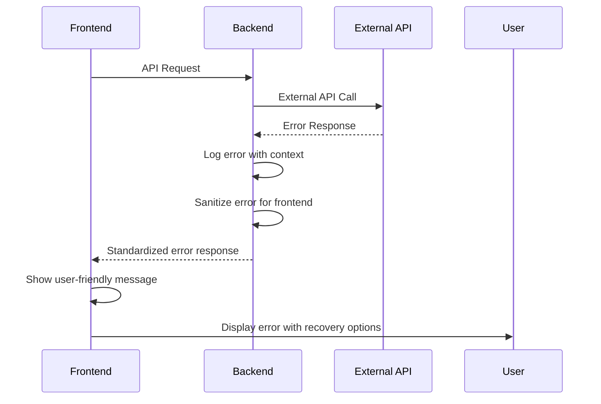

# Error Handling Strategy

## Unified Error Flow



## Error Response Format

```typescript
interface ApiError {
  error: {
    code: string;
    message: string;
    details?: Record<string, any>;
    timestamp: string;
    requestId: string;
  };
}
```

## Frontend Error Handling

```typescript
// Redux error handling
const conversationApi = createApi({
  // ... other config
  endpoints: (builder) => ({
    sendMessage: builder.mutation({
      query: (data) => ({ url: '/conversation/send', method: 'POST', body: data }),
      transformErrorResponse: (response) => {
        // Transform backend errors for UI
        return {
          status: response.status,
          message: response.data?.error?.message || 'Something went wrong',
          code: response.data?.error?.code || 'UNKNOWN_ERROR'
        };
      }
    })
  })
});

// Component error handling
const OnboardingWizard = () => {
  const { error, isError } = useSendMessageMutation();
  
  if (isError) {
    return (
      <ErrorBoundary>
        <UserFriendlyError 
          message={error.message} 
          onRetry={() => /* retry logic */}
        />
      </ErrorBoundary>
    );
  }
};
```

## Backend Error Handling

```python
from fastapi import HTTPException
from fastapi.responses import JSONResponse
import logging

class APIError(Exception):
    def __init__(self, code: str, message: str, status_code: int = 400):
        self.code = code
        self.message = message
        self.status_code = status_code

@app.exception_handler(APIError)
async def api_error_handler(request: Request, exc: APIError):
    return JSONResponse(
        status_code=exc.status_code,
        content={
            "error": {
                "code": exc.code,
                "message": exc.message,
                "timestamp": datetime.now().isoformat(),
                "requestId": str(uuid.uuid4())
            }
        }
    )
