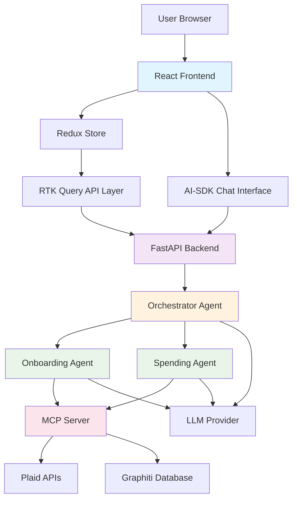

# High Level Architecture

## Technical Summary

The AI Financial Assistant employs an **agentic AI architecture** with clear separation between frontend and backend concerns. The Python FastAPI backend serves the React frontend while orchestrating specialized AI agents through LangGraph. An Orchestrator Agent routes user requests to domain specialists (Onboarding, Spending) that access shared tools via MCP server for secure financial data processing and contextual memory. The frontend uses Redux Toolkit for predictable state management and AI-SDK for seamless conversational interfaces. This architecture prioritizes **security** for financial data, **user trust** through transparent AI interactions, and **development velocity** for POC validation.

## Platform and Infrastructure Choice

**Platform**: Self-hosted Docker deployment for development flexibility
**Rationale**: Avoids vendor lock-in during POC phase while maintaining production deployment options

**Key Services**:
- **Compute**: Docker containers for consistent development/production environments
- **Storage**: In-memory storage for POC (Redis-compatible for future scaling)
- **AI Services**: Configurable LLM providers via environment variables
- **Financial APIs**: Plaid integration via MCP server for multi-agent access
- **Tool Server**: MCP server providing centralized Plaid APIs and Graphiti database access
- **Graph Database**: Graphiti for contextual memory and relationship tracking

## Repository Structure

**Structure**: Monorepo with clear frontend/backend separation
**Rationale**: Enables coordinated development of tightly coupled frontend/backend features while maintaining clear boundaries

**Package Organization**:
```text
ai-financial-assistant/
├── frontend/           # React application
├── backend/           # FastAPI application + integrated MCP server
│   └── mcp_server/    # MCP tools accessible at /mcp endpoint
├── scripts/          # Development and deployment scripts
└── docs/             # Documentation
```

**MCP Integration Strategy**:
- **POC Approach**: MCP server mounted within FastAPI at `/mcp` endpoint for simplified single-container deployment
- **Lifecycle Management**: Combined lifespan management ensures FastAPI and MCP server start/stop together
- **Future Flexibility**: `run_server()` function enables independent MCP server deployment when multi-service architecture is required
- **Benefits**: Shared authentication, configuration, and operational simplicity during POC validation phase

## High Level Architecture Diagram



## Architectural Patterns

- **Monolithic Deployment with Modular Design**: Single deployment unit with clear internal boundaries for easier POC development
- **API-First Backend**: RESTful endpoints designed for frontend consumption with clear contracts
- **State-Driven Frontend**: Redux patterns for predictable state management across complex financial data flows
- **Conversational AI Integration**: Streaming AI responses integrated with application state for seamless user experience
- **Secure Financial Data Handling**: Defense-in-depth approach with encryption, tokenization, and minimal data retention
