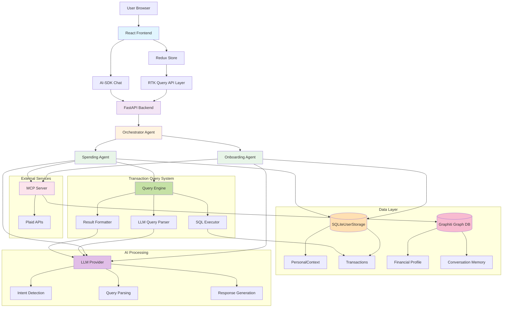
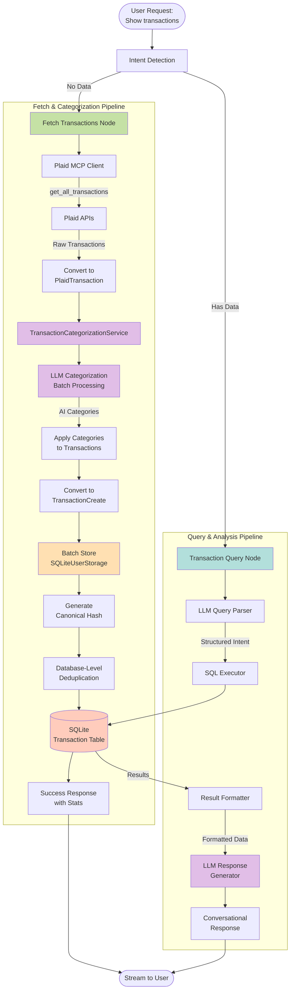

# High Level Architecture

## Technical Summary

The AI Financial Assistant employs an **agentic AI architecture** with clear separation between frontend and backend concerns. The Python FastAPI backend serves the React frontend while orchestrating specialized AI agents through LangGraph. An Orchestrator Agent routes user requests to domain specialists (Onboarding, Spending) that access shared tools via MCP server for secure financial data processing and contextual memory. The frontend uses Redux Toolkit for predictable state management and AI-SDK for seamless conversational interfaces. This architecture prioritizes **security** for financial data, **user trust** through transparent AI interactions, and **development velocity** for POC validation.

## Platform and Infrastructure Choice

**Platform**: Self-hosted Docker deployment for development flexibility
**Rationale**: Avoids vendor lock-in during POC phase while maintaining production deployment options

**Key Services**:
- **Compute**: Docker containers for consistent development/production environments
- **Structured Storage**: SQLite (SQLiteUserStorage) for PersonalContext demographics and Transaction ledger
- **Graph Storage**: Graphiti for Financial Profile and conversational memory (onboarding only)
- **AI Services**: Configurable LLM providers via environment variables
- **Financial APIs**: Plaid integration via MCP server for multi-agent access
- **Tool Server**: MCP server providing centralized Plaid APIs and Graphiti database access
- **Transaction Query System**: LLM-driven natural language to SQL query engine with context-aware formatting

## Repository Structure

**Structure**: Monorepo with clear frontend/backend separation
**Rationale**: Enables coordinated development of tightly coupled frontend/backend features while maintaining clear boundaries

**Package Organization**:
```text
ai-financial-assistant/
├── frontend/           # React application
├── backend/           # FastAPI application + integrated MCP server
│   └── mcp_server/    # MCP tools accessible at /mcp endpoint
├── scripts/          # Development and deployment scripts
└── docs/             # Documentation
```

**MCP Integration Strategy**:
- **POC Approach**: MCP server mounted within FastAPI at `/mcp` endpoint for simplified single-container deployment
- **Lifecycle Management**: Combined lifespan management ensures FastAPI and MCP server start/stop together
- **Scope**: MCP server reserved for external API integrations only (Plaid tools, future external services)
- **Service Layer**: Internal business logic implemented as direct service layer for better performance
- **Future Flexibility**: `run_server()` function enables independent MCP server deployment when multi-service architecture is required
- **Benefits**: Shared authentication, configuration, and operational simplicity during POC validation phase

## High Level Architecture Diagram



## Key Architectural Components

### Data Layer
**SQLiteUserStorage (Unified Storage)**:
- Single source of truth for structured data (PersonalContext + Transactions)
- ACID transaction guarantees for data consistency
- Efficient SQL queries for demographic logic and spending analysis
- Canonical transaction ledger with hash-based deduplication

**Graphiti Graph Database**:
- Financial profile and conversational memory (onboarding workflow only)
- Relationship-rich context for AI-driven recommendations
- User isolation via `user_id` as `group_id`

### Transaction Query System
**LLM-Driven Query Engine**:
- Natural language input → structured query intent extraction
- Safe SQL template execution with parameterized queries
- Context-aware result formatting (summaries, breakdowns, individual transactions)
- Time range context (start_date, end_date, days_back) for accurate LLM responses

**Query Flow**:
1. User asks: "How much did I spend on Uber last month?"
2. LLM Parser extracts: `{intent: "search_by_merchant", merchant: "Uber", days_back: 30}`
3. SQL Executor runs parameterized query against Transactions table
4. Result Formatter identifies data structure and formats for LLM
5. LLM generates conversational response with specific amounts, dates, categories

### Agent Architecture
**Onboarding Agent**:
- Stores conversations in Graphiti for profile building
- Writes PersonalContext to SQLite for app routing
- Accesses Plaid APIs via MCP server

**Spending Agent**:
- Reads PersonalContext from SQLite for context
- Queries Transactions via Transaction Query System
- Fetches new transactions via Plaid MCP tools
- Pure SQLite workflow (no Graphiti dependency)

## Transaction Ingestion Pipeline

The system implements a sophisticated multi-stage pipeline for fetching, categorizing, and storing financial transactions:



### Pipeline Stages

**Stage 1: Fetch (Plaid Integration)**
- Spending Agent calls `_fetch_transactions()` with 30s timeout
- Shared PlaidMCPClient invokes `get_all_transactions` MCP tool
- Raw transaction data returned from Plaid APIs
- Conversion to `PlaidTransaction` objects

**Stage 2: AI Categorization**
- `TransactionCategorizationService` processes transactions in batches
- LLM analyzes merchant names, amounts, and patterns
- Assigns `ai_category` and `ai_subcategory` with confidence scores
- Categories applied to transaction objects

**Stage 3: Storage & Deduplication**
- Convert to `TransactionCreate` models with user_id
- `batch_create_transactions()` performs bulk insert
- Canonical hash generated from (user_id, plaid_transaction_id, date, amount)
- Database-level ON CONFLICT DO NOTHING prevents duplicates
- Returns stats: stored, duplicates, errors

**Stage 4: Query & Analysis** (Subsequent Requests)
- LLM parses natural language query to structured intent
- SQL Executor runs parameterized query against Transaction table
- Result Formatter identifies data structure and formats for LLM
- LLM generates conversational response with insights

### Key Features

**Duplicate Prevention**:
- Hash-based deduplication using canonical_hash as primary key
- Database constraints prevent duplicate storage
- Idempotent fetch operations safe to retry

**Batch Processing**:
- LLM categorization processes multiple transactions per API call
- Bulk SQL inserts for efficiency
- Graceful degradation if categorization fails

**Error Handling**:
- 30-second timeout on Plaid fetch operations
- 3 retry attempts with context-aware error messages
- Transactions stored even if categorization partially fails

**Performance**:
- Single batch categorization LLM call for all new transactions
- SQLite bulk insert with RETURNING clause for feedback
- Hash-based deduplication in database layer

## Architectural Patterns

- **Dual-Storage Strategy**: SQLite for queryable structured data, Graphiti for conversational context
- **Unified Storage Layer**: Single SQLiteUserStorage class for both PersonalContext and Transactions
- **LLM-as-Query-Parser**: Natural language interface to structured transaction data
- **Multi-Stage Processing Pipeline**: Fetch → Categorize → Store → Query workflow
- **Idempotent Operations**: Hash-based deduplication enables safe retries
- **Monolithic Deployment with Modular Design**: Single deployment unit with clear internal boundaries for easier POC development
- **API-First Backend**: RESTful endpoints designed for frontend consumption with clear contracts
- **State-Driven Frontend**: Redux patterns for predictable state management across complex financial data flows
- **Conversational AI Integration**: Streaming AI responses integrated with application state for seamless user experience
- **Secure Financial Data Handling**: Defense-in-depth approach with encryption, tokenization, and minimal data retention
