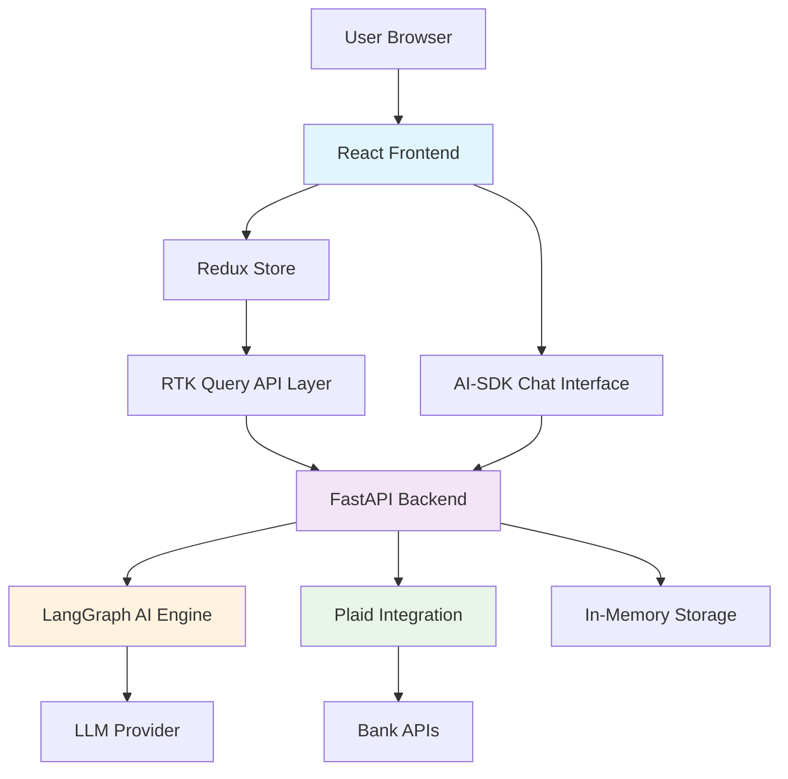

# High Level Architecture

## Technical Summary

The AI Financial Assistant employs a **monolithic fullstack architecture** with clear separation between frontend and backend concerns. The Python FastAPI backend serves the React frontend while orchestrating AI conversations through LangGraph and secure financial data processing via Plaid. The frontend uses Redux Toolkit for predictable state management and AI-SDK for seamless conversational interfaces. This architecture prioritizes **security** for financial data, **user trust** through transparent AI interactions, and **development velocity** for POC validation.

## Platform and Infrastructure Choice

**Platform**: Self-hosted Docker deployment for development flexibility
**Rationale**: Avoids vendor lock-in during POC phase while maintaining production deployment options

**Key Services**:
- **Compute**: Docker containers for consistent development/production environments
- **Storage**: In-memory storage for POC (Redis-compatible for future scaling)
- **AI Services**: Configurable LLM providers via environment variables
- **Financial APIs**: Plaid for secure bank account integration

## Repository Structure

**Structure**: Monorepo with clear frontend/backend separation
**Rationale**: Enables coordinated development of tightly coupled frontend/backend features while maintaining clear boundaries

**Package Organization**:
```text
ai-financial-assistant/
├── frontend/           # React application
├── backend/           # FastAPI application  
├── scripts/          # Development and deployment scripts
└── docs/             # Documentation
```

## High Level Architecture Diagram



## Architectural Patterns

- **Monolithic Deployment with Modular Design**: Single deployment unit with clear internal boundaries for easier POC development
- **API-First Backend**: RESTful endpoints designed for frontend consumption with clear contracts
- **State-Driven Frontend**: Redux patterns for predictable state management across complex financial data flows
- **Conversational AI Integration**: Streaming AI responses integrated with application state for seamless user experience
- **Secure Financial Data Handling**: Defense-in-depth approach with encryption, tokenization, and minimal data retention
