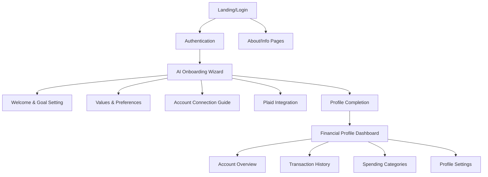
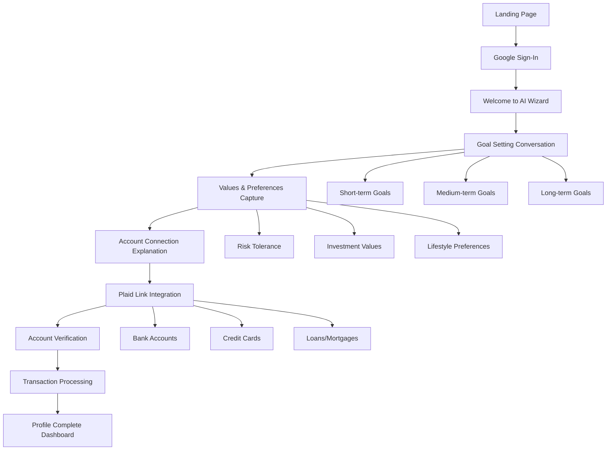
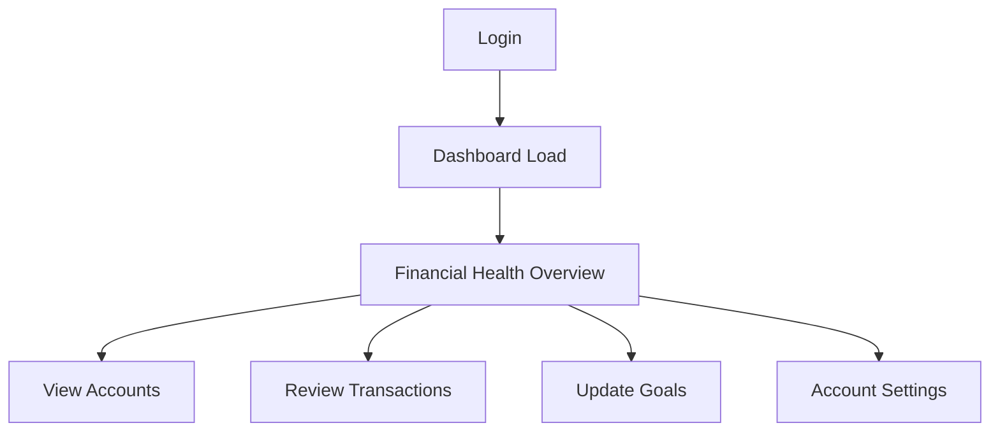

# AI Financial Assistant UI/UX Specification

## Introduction

This document defines the user experience goals, information architecture, user flows, and visual design specifications for the AI Financial Assistant's user interface. It serves as the foundation for visual design and frontend development, ensuring a cohesive and user-centered experience that builds trust while making complex financial data accessible.

### Change Log
| Date | Version | Description | Author |
|------|---------|-------------|--------|
| [Date] | 1.0 | Initial UI/UX specification | UX Expert |

## Overall UX Goals & Principles

### Target User Personas

**Primary User**: Household Decision Makers (Ages 20-50)
- **Characteristics**: Middle-income professionals managing multiple financial responsibilities
- **Pain Points**: Overwhelmed by financial complexity, lack spending clarity, difficulty aligning money decisions with personal goals
- **Goals**: Understand financial patterns, get personalized guidance, improve financial outcomes
- **Trust Factors**: Transparency about data use, clear explanations, professional but approachable interface

### Usability Goals
- **Ease of onboarding**: New users complete financial profiling within 10 minutes without confusion
- **Trust building**: Every interaction reinforces security and competence through design choices
- **Clarity over complexity**: Financial data presented in digestible, actionable formats
- **Guided discovery**: AI wizard helps users understand their own financial patterns
- **Mobile accessibility**: Core flows work seamlessly on mobile devices

### Design Principles
1. **Transparency over cleverness** - Every AI recommendation must be explainable and trustworthy
2. **Progressive guidance** - Reveal complexity gradually, starting with high-level insights
3. **Conversational professionalism** - Friendly coaching tone without sacrificing credibility
4. **Visual confidence** - Data visualizations that make users feel informed, not overwhelmed
5. **Security visibility** - Make security measures apparent without being intrusive

## Information Architecture

### Site Map / Screen Inventory



### Navigation Structure

**Primary Navigation**: Minimal during POC - focused on core user journey
- Dashboard (post-onboarding)
- Profile Settings
- Help/Support

**Onboarding Flow Navigation**: 
- Progress indicators showing current step
- Back/Next with smart validation
- Exit/Save and Resume capability

**Post-Onboarding Navigation**:
- Dashboard as home base
- Quick access to profile editing
- Account management

## User Flows

### Flow 1: First-Time User Onboarding

**User Goal**: Complete financial profile setup with account connections and goal definition

**Entry Points**: Landing page, referral links, direct signup

**Success Criteria**: User reaches completed profile dashboard with connected accounts and defined goals

#### Flow Diagram


#### Edge Cases & Error Handling:
- **Plaid connection failure**: AI wizard provides alternative guidance and retry options
- **Partial goal completion**: Allow saving progress and resuming later
- **Account connection hesitancy**: AI explains security measures and benefits
- **Session timeout**: Auto-save progress with easy resumption

**Notes**: The AI wizard should feel like a knowledgeable financial advisor having a structured conversation, not an interrogation form.

### Flow 2: Return User Dashboard Access

**User Goal**: Quickly access financial overview and review profile

**Entry Points**: Direct login, bookmark, mobile app

**Success Criteria**: User sees updated financial data and can navigate to key areas

#### Flow Diagram


## Component Design & Visual Structure

### Key Component Specifications

#### AI Conversation Widget
**Purpose**: Core conversational interface for onboarding wizard

**Key Elements**:
- Chat-style message bubbles with AI avatar
- User input field with smart suggestions
- Progress indicator showing onboarding completion
- "Thinking" indicator for AI processing states

**States**: 
- Active conversation
- Waiting for user input
- Processing/thinking
- Error state with helpful recovery

**Usage Guidelines**: Maintain conversational flow while capturing structured data. AI responses should feel natural but guide toward completion.

#### Financial Account Card
**Purpose**: Display connected account information clearly and securely

**Key Elements**:
- Bank logo and account type
- Masked account numbers (last 4 digits)
- Current balance with positive/negative indicators
- Connection status and last sync time
- Quick disconnect option

**Variants**:
- Connected (full data display)
- Connecting (loading state)
- Error (reconnection needed)
- Disconnected (greyed out)

#### Goal Progress Indicator
**Purpose**: Visual representation of financial goal achievement

**Key Elements**:
- Progress bar with current vs target amounts
- Timeline indicator (months/years remaining)
- Goal title and description
- Quick edit functionality

**States**:
- On track (green)
- Behind schedule (yellow)
- At risk (red)
- Achieved (celebratory state)

#### Transaction Category Summary
**Purpose**: Spending breakdown by category for quick understanding

**Key Elements**:
- Category icon and name
- Amount and percentage of total spending
- Trend indicator (up/down from previous period)
- Quick drill-down to transaction details

### Responsive Design Strategy

#### Breakpoints
| Breakpoint | Min Width | Max Width | Target Devices |
|------------|-----------|-----------|----------------|
| Mobile | 320px | 767px | Smartphones |
| Tablet | 768px | 1023px | Tablets, small laptops |
| Desktop | 1024px | 1439px | Standard desktops |
| Large | 1440px+ | - | Large monitors |

#### Adaptation Patterns
**Layout Changes**: 
- Mobile: Single column, stacked components
- Tablet: Two-column with priority content on left
- Desktop: Multi-column dashboard with sidebar navigation

**Onboarding Wizard Changes**:
- Mobile: Full-screen conversation interface
- Desktop: Centered dialog with ambient background

## Visual Design System

### Color Palette
| Color Type | Hex Code | Usage |
|------------|----------|-------|
| Primary | #2563eb | Call-to-action buttons, progress indicators |
| Secondary | #059669 | Success states, positive financial data |
| Accent | #dc2626 | Alerts, negative balances, warnings |
| Success | #16a34a | Goal achievements, positive trends |
| Warning | #ca8a04 | Cautions, account connection issues |
| Error | #dc2626 | Errors, critical alerts |
| Neutral | #64748b | Text, borders, secondary elements |

### Typography
#### Font Families
- **Primary**: Inter (clean, professional, excellent readability)
- **Secondary**: System fonts (fallback)
- **Monospace**: SF Mono (account numbers, financial data)

#### Type Scale
| Element | Size | Weight | Line Height |
|---------|------|--------|-------------|
| H1 | 32px | 600 | 1.2 |
| H2 | 24px | 600 | 1.3 |
| H3 | 20px | 500 | 1.4 |
| Body | 16px | 400 | 1.5 |
| Small | 14px | 400 | 1.4 |

### Iconography
**Icon Library**: Lucide React (consistent, professional, financial-appropriate icons)

**Usage Guidelines**: 
- Use outline style for consistency
- 24px standard size, 16px for inline elements
- Pair with text labels for accessibility

### Spacing & Layout
**Grid System**: 8px base unit for consistent spacing

**Spacing Scale**: 8px, 16px, 24px, 32px, 48px, 64px

## Trust-Building Design Elements

### Security Indicators
- SSL badge visibility
- Bank-level security messaging
- Clear data usage explanations
- Plaid security partnership highlighting

### Professional Credibility
- Clean, uncluttered layouts
- Consistent color usage for financial states
- Professional typography choices
- Subtle animations that enhance rather than distract

### Transparency Features
- Clear explanation of AI recommendations
- Data source attribution
- Easy access to privacy settings
- Obvious way to disconnect accounts

## Implementation Guidelines

### React Component Architecture

#### Component Organization
```text
src/
├── components/
│   ├── common/           # Reusable UI components
│   │   ├── Button/
│   │   ├── Card/
│   │   ├── ProgressBar/
│   │   └── LoadingSpinner/
│   ├── onboarding/       # Wizard-specific components
│   │   ├── AIConversation/
│   │   ├── GoalSetting/
│   │   ├── PlaidConnect/
│   │   └── WizardProgress/
│   ├── dashboard/        # Post-onboarding components
│   │   ├── AccountCard/
│   │   ├── TransactionList/
│   │   ├── SpendingChart/
│   │   └── ProfileSummary/
│   └── layout/           # Layout components
│       ├── Header/
│       ├── Navigation/
│       └── AuthGuard/
```

#### Component Standards

**Base Component Template**:
```typescript
interface ComponentProps {
  // Props definition with clear types
}

const Component: React.FC<ComponentProps> = ({ 
  // Destructured props
}) => {
  // Component logic
  
  return (
    <div className="component-container">
      {/* JSX structure */}
    </div>
  );
};

export default Component;
```

**Key Implementation Patterns**:
- Use TypeScript for all components
- Implement proper prop validation
- Follow compound component pattern for complex widgets
- Use React.memo for performance optimization where needed

### State Management Strategy (Redux Toolkit)

#### Redux Toolkit for Global State Management:
- **Redux Toolkit (RTK)** for predictable state management
- **RTK Query** for API integration and caching
- **Redux Persist** for maintaining state across sessions (user preferences, partial onboarding)

#### State Structure:
```typescript
interface RootState {
  auth: {
    user: User | null;
    isAuthenticated: boolean;
    loading: boolean;
  };
  onboarding: {
    currentStep: number;
    progress: number;
    wizardData: WizardData;
    isComplete: boolean;
  };
  accounts: {
    connected: Account[];
    selectedAccount: string | null;
  };
  ui: {
    sidebarOpen: boolean;
    activeModal: string | null;
    notifications: Notification[];
  };
}
```

#### RTK Slices Structure:
```text
src/store/
├── index.ts              # Store configuration
├── slices/
│   ├── authSlice.ts      # Authentication state
│   ├── onboardingSlice.ts # Wizard progress
│   ├── accountsSlice.ts  # Financial accounts
│   └── uiSlice.ts        # UI state
└── api/
    ├── authApi.ts        # Auth endpoints
    ├── plaidApi.ts       # Plaid integration
    └── conversationApi.ts # AI conversation
```

### AI Conversation Integration

#### AI-SDK Integration Pattern:
```typescript
// In your onboarding component
import { useChat } from 'ai/react';

const OnboardingWizard = () => {
  const { messages, input, handleInputChange, handleSubmit, isLoading } = useChat({
    api: '/api/chat/onboarding',
    onFinish: (message) => {
      // Update Redux state with conversation results
      dispatch(updateWizardStep(message.data));
    }
  });

  // Component implementation
};
```

### API Integration with RTK Query

#### RTK Query API Structure:
```typescript
// plaidApi.ts
export const plaidApi = createApi({
  reducerPath: 'plaidApi',
  baseQuery: fetchBaseQuery({
    baseUrl: '/api/plaid',
    prepareHeaders: (headers, { getState }) => {
      const token = (getState() as RootState).auth.token;
      if (token) {
        headers.set('authorization', `Bearer ${token}`);
      }
      return headers;
    },
  }),
  tagTypes: ['Account', 'Transaction'],
  endpoints: (builder) => ({
    connectAccount: builder.mutation<PlaidResponse, PlaidTokenRequest>({
      query: (data) => ({
        url: '/connect',
        method: 'POST',
        body: data,
      }),
      invalidatesTags: ['Account'],
    }),
    getAccounts: builder.query<Account[], void>({
      query: () => '/accounts',
      providesTags: ['Account'],
    }),
    getTransactions: builder.query<Transaction[], string>({
      query: (accountId) => `/transactions/${accountId}`,
      providesTags: ['Transaction'],
    }),
  }),
});
```

### Styling Implementation

#### CSS-in-JS with Styled Components
**Recommendation**: Use styled-components for component-level styling with theme support

**Theme Configuration**:
```typescript
const theme = {
  colors: {
    primary: '#2563eb',
    success: '#16a34a',
    warning: '#ca8a04',
    error: '#dc2626',
    neutral: '#64748b'
  },
  spacing: {
    xs: '8px',
    sm: '16px',
    md: '24px',
    lg: '32px',
    xl: '48px'
  },
  typography: {
    fontFamily: "'Inter', sans-serif",
    sizes: {
      h1: '32px',
      h2: '24px',
      body: '16px',
      small: '14px'
    }
  }
};
```

### Critical Implementation Requirements

#### AI Conversation Component
- **Real-time messaging**: WebSocket or polling for AI responses
- **Message persistence**: Save conversation state during onboarding
- **Input validation**: Handle various user input formats gracefully
- **Error recovery**: Graceful handling of AI service failures

#### Plaid Integration
- **Secure token handling**: Never expose sensitive tokens in frontend
- **Connection state management**: Clear loading/success/error states
- **Account data display**: Secure formatting of financial information
- **Disconnection flow**: Easy account removal with confirmation

#### Financial Data Visualization
- **Number formatting**: Consistent currency and percentage display
- **Loading states**: Skeleton screens for data-heavy components
- **Error boundaries**: Graceful failure handling for chart components
- **Responsive charts**: Mobile-friendly data visualization

### Performance Considerations

#### Code Splitting
- Route-based splitting for onboarding vs dashboard
- Component-level splitting for heavy financial charts
- Lazy loading for non-critical components

#### Optimization Strategies
- Memoize expensive calculations (cash flow, categorization)
- Debounce user inputs in conversation interface
- Optimize re-renders with React.memo and useMemo
- Implement virtual scrolling for large transaction lists

### Security Implementation

#### Frontend Security Measures
- **No sensitive data storage**: Never store tokens/keys in localStorage
- **API communication**: HTTPS only, proper CORS configuration
- **Input sanitization**: Sanitize all user inputs before display
- **Session management**: Proper JWT handling with secure storage

#### Data Display Security
- **Account masking**: Show only last 4 digits of account numbers
- **Amount formatting**: Secure display of financial amounts
- **Error message safety**: No sensitive data in error messages

## Development Workflow

### Component Development Process
1. **Design Review**: Confirm component matches design specifications
2. **TypeScript First**: Define interfaces before implementation
3. **Story-driven**: Build components with Storybook stories
4. **Test Coverage**: Unit tests for business logic, integration tests for user flows
5. **Performance Check**: Monitor bundle size and rendering performance

### Quality Gates
- **TypeScript**: Zero type errors
- **ESLint**: No linting errors with financial app security rules
- **Testing**: 80%+ coverage for critical user flows
- **Performance**: Lighthouse score >90 for key pages

### Development Dependencies

```json
{
  "dependencies": {
    "@reduxjs/toolkit": "^1.9.x",
    "react-redux": "^8.1.x",
    "redux-persist": "^6.0.x",
    "ai": "^2.2.x",
    "react-plaid-link": "^3.4.x",
    "styled-components": "^6.0.x",
    "lucide-react": "^0.263.x"
  }
}
```

## Next Steps

### Immediate Actions
1. Save this specification as `docs/front-end-spec.md` in your project
2. Proceed to create technical architecture that implements this UI/UX vision
3. Consider generating AI frontend prompts for rapid prototyping with v0/Lovable

### Design Handoff Checklist
- [x] All user flows documented
- [x] Component inventory complete
- [x] Responsive strategy clear
- [x] Brand guidelines incorporated
- [x] Performance goals established
- [x] Implementation strategy defined
- [x] Security considerations addressed
- [x] State management architecture defined