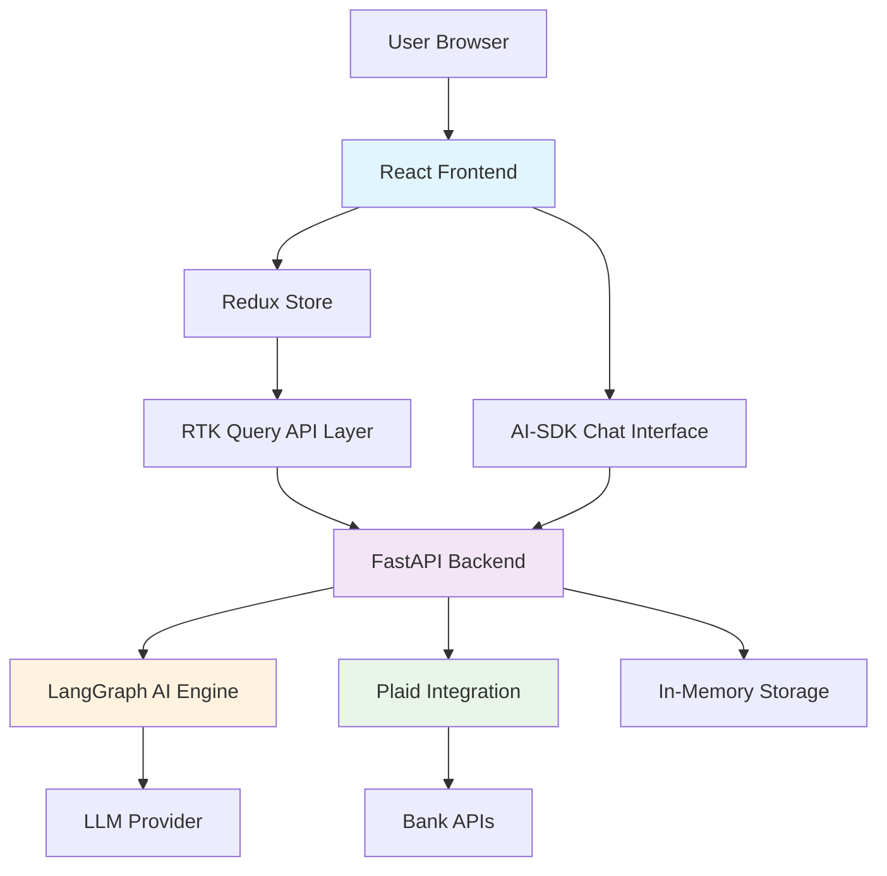
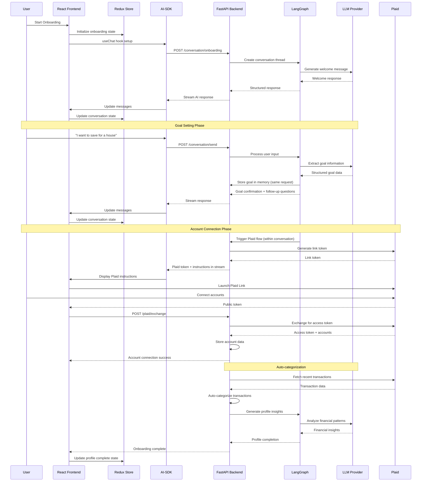
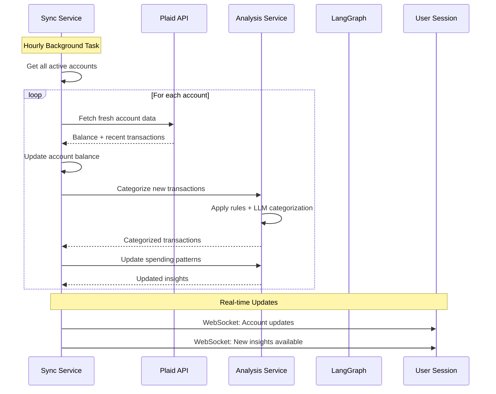
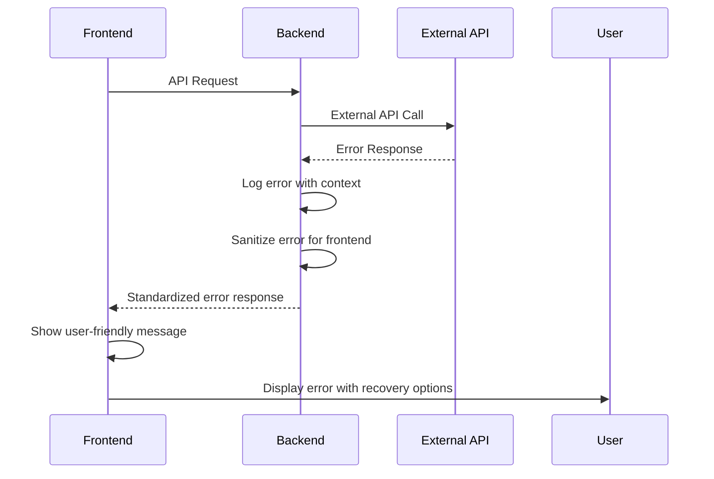

# AI Financial Assistant Fullstack Architecture Document

## Introduction

This document outlines the complete fullstack architecture for the AI Financial Assistant POC, including backend systems, frontend implementation, and their integration. It serves as the single source of truth for AI-driven development, ensuring consistency across the entire technology stack.

This unified approach streamlines development for the modern fullstack application where frontend state management, AI conversations, and financial data processing are tightly integrated.

### Starter Template Assessment

Based on your requirements analysis:
**Decision**: Custom setup recommended over starter templates
**Rationale**: 
- Financial applications require specific security configurations
- LangGraph + Plaid integration needs custom backend architecture  
- Redux + AI-SDK frontend patterns not available in standard templates
- POC scope benefits from minimal, focused setup

### Change Log
| Date | Version | Description | Author |
|------|---------|-------------|--------|
| [Date] | 1.0 | Initial fullstack architecture | Architect |

## High Level Architecture

### Technical Summary

The AI Financial Assistant employs a **monolithic fullstack architecture** with clear separation between frontend and backend concerns. The Python FastAPI backend serves the React frontend while orchestrating AI conversations through LangGraph and secure financial data processing via Plaid. The frontend uses Redux Toolkit for predictable state management and AI-SDK for seamless conversational interfaces. This architecture prioritizes **security** for financial data, **user trust** through transparent AI interactions, and **development velocity** for POC validation.

### Platform and Infrastructure Choice

**Platform**: Self-hosted Docker deployment for development flexibility
**Rationale**: Avoids vendor lock-in during POC phase while maintaining production deployment options

**Key Services**:
- **Compute**: Docker containers for consistent development/production environments
- **Storage**: In-memory storage for POC (Redis-compatible for future scaling)
- **AI Services**: Configurable LLM providers via environment variables
- **Financial APIs**: Plaid for secure bank account integration

### Repository Structure

**Structure**: Monorepo with clear frontend/backend separation
**Rationale**: Enables coordinated development of tightly coupled frontend/backend features while maintaining clear boundaries

**Package Organization**:
```text
ai-financial-assistant/
├── frontend/           # React application
├── backend/           # FastAPI application  
├── scripts/          # Development and deployment scripts
└── docs/             # Documentation
```

### High Level Architecture Diagram



### Architectural Patterns

- **Monolithic Deployment with Modular Design**: Single deployment unit with clear internal boundaries for easier POC development
- **API-First Backend**: RESTful endpoints designed for frontend consumption with clear contracts
- **State-Driven Frontend**: Redux patterns for predictable state management across complex financial data flows
- **Conversational AI Integration**: Streaming AI responses integrated with application state for seamless user experience
- **Secure Financial Data Handling**: Defense-in-depth approach with encryption, tokenization, and minimal data retention

## Tech Stack

This is the DEFINITIVE technology selection for the entire project. All development must use these exact versions and configurations.

### Technology Stack Table

| Category | Technology | Version | Purpose | Rationale |
|----------|------------|---------|---------|-----------|
| **Frontend Language** | TypeScript | 5.3.x | Type-safe frontend development | Essential for financial app reliability and Redux integration |
| **Frontend Framework** | React | 18.2.x | User interface framework | Mature ecosystem, excellent AI-SDK integration |
| **UI Component Library** | Styled Components | 6.1.x | Component styling and theming | Consistent design system implementation |
| **State Management** | Redux Toolkit | 1.9.x | Predictable state management | Complex financial data flows require predictable state |
| **Backend Language** | Python | 3.11.x | Server-side development | Excellent AI/ML ecosystem, FastAPI compatibility |
| **Backend Framework** | FastAPI | 0.104.x | API framework with auto-docs | Async support, automatic OpenAPI generation, security features |
| **API Style** | REST | OpenAPI 3.0 | Client-server communication | Simple, well-understood, excellent tooling |
| **Database** | In-Memory Dict | POC Only | Data storage for POC | Simplifies POC development, Redis-compatible transition path |
| **Cache** | In-Memory | POC Only | Session and conversation caching | Sufficient for POC user load |
| **Authentication** | Google OAuth + JWT | OAuth 2.0 | User authentication and session management | Trusted provider, reduces password management |
| **Frontend Testing** | Jest + Testing Library | Latest | Component and integration testing | React ecosystem standard |
| **Backend Testing** | Pytest + httpx | Latest | API and business logic testing | Python standard with async support |
| **Build Tool** | Vite | 5.0.x | Frontend build and dev server | Fast development experience, modern tooling |
| **Bundler** | Vite (esbuild) | Built-in | JavaScript bundling and optimization | Superior performance for development iterations |
| **CSS Framework** | Styled Components + Theme | 6.1.x | Styling architecture | Component-scoped styling with theming support |
| **AI Framework** | LangGraph | 0.0.x | AI conversation orchestration | Configurable LLM integration, conversation state management |
| **Frontend AI** | AI-SDK | 2.2.x | React AI conversation interface | Seamless streaming AI integration with React |
| **Financial API** | Plaid | Latest | Bank account and transaction data | Industry standard for financial data aggregation |
| **API Client** | RTK Query | Built-in RTK | Frontend API state management | Integrated caching and state management |
| **Container** | Docker | 24.x | Development and deployment consistency | Consistent environments across development/production |
| **Package Manager** | UV | Latest | Python dependency management | Modern, fast Python dependency resolution |

## Data Models

### Core Business Entities

Based on POC requirements (Epic 1 & 2), here are the essential data models:

#### Python Data Models for In-Memory Storage

```python
from dataclasses import dataclass, field
from typing import List, Optional, Dict, Any
from datetime import datetime
from enum import Enum

class RiskTolerance(Enum):
    CONSERVATIVE = "conservative"
    MODERATE = "moderate"
    AGGRESSIVE = "aggressive"

class Priority(Enum):
    HIGH = "high"
    MEDIUM = "medium"
    LOW = "low"

class AccountType(Enum):
    CHECKING = "checking"
    SAVINGS = "savings"
    CREDIT = "credit"
    LOAN = "loan"
    MORTGAGE = "mortgage"

@dataclass
class Goal:
    id: str
    title: str
    description: str  # Plain text description for LLM understanding
    target_amount: Optional[float] = None  # May be vague/undefined
    target_date: Optional[str] = None  # May be vague/undefined
    priority: Priority = Priority.MEDIUM
    created_at: datetime = field(default_factory=datetime.now)

@dataclass
class User:
    id: str
    email: str
    created_at: datetime = field(default_factory=datetime.now)
    profile_complete: bool = False

@dataclass
class UserProfile:
    user_id: str
    short_term_goals: List[Goal] = field(default_factory=list)
    medium_term_goals: List[Goal] = field(default_factory=list)
    long_term_goals: List[Goal] = field(default_factory=list)
    risk_tolerance: RiskTolerance = RiskTolerance.MODERATE
    values: List[str] = field(default_factory=list)
    ethical_investing: bool = False
    lifestyle_preferences: List[str] = field(default_factory=list)
    updated_at: datetime = field(default_factory=datetime.now)

@dataclass
class PlaidAccount:
    id: str
    user_id: str
    plaid_account_id: str
    plaid_access_token: str  # Encrypted storage
    account_type: AccountType
    account_name: str
    balance: float
    last_synced: datetime = field(default_factory=datetime.now)
    is_active: bool = True

@dataclass
class Transaction:
    id: str
    account_id: str
    plaid_transaction_id: str
    amount: float  # Negative for expenses, positive for income
    category: str
    subcategory: Optional[str] = None
    description: str
    date: str  # ISO date string
    pending: bool = False
    auto_categorized: bool = False  # Flag for automatic categorization

@dataclass
class Message:
    id: str
    role: str  # 'user' or 'assistant'
    content: str
    timestamp: datetime = field(default_factory=datetime.now)
    metadata: Dict[str, Any] = field(default_factory=dict)

@dataclass
class ConversationSession:
    id: str
    user_id: str
    session_type: str  # 'onboarding', 'general', 'support'
    thread_id: str  # LangGraph thread identifier
    completed: bool = False
    created_at: datetime = field(default_factory=datetime.now)
    # LangGraph handles conversation state via checkpointer
```

### LangGraph Integration for ConversationSession

**LangGraph Checkpointer System**:

```python
from langgraph.checkpoint.memory import MemorySaver
from langgraph.checkpoint.sqlite import SqliteSaver

# For POC: In-memory checkpointer
memory_checkpointer = MemorySaver()

# Future: Persistent checkpointer  
# sqlite_checkpointer = SqliteSaver("checkpoints.db")
```

### In-Memory Data Store Structure

```python
class InMemoryDataStore:
    def __init__(self):
        # User data
        self.users: Dict[str, User] = {}
        self.user_profiles: Dict[str, UserProfile] = {}  # user_id -> profile
        
        # Financial data
        self.plaid_accounts: Dict[str, PlaidAccount] = {}  # account_id -> account
        self.user_accounts: Dict[str, List[str]] = {}  # user_id -> [account_ids]
        
        # Conversation data  
        self.conversation_sessions: Dict[str, ConversationSession] = {}
        self.user_sessions: Dict[str, List[str]] = {}  # user_id -> [session_ids]
        
        # LangGraph checkpointer
        self.langgraph_checkpointer = MemorySaver()
        
        # Temporary transaction cache (cleared periodically)
        self.transaction_cache: Dict[str, List[Transaction]] = {}  # account_id -> transactions
        self.cache_timestamps: Dict[str, datetime] = {}  # account_id -> last_fetch
        
        # Analysis cache
        self.spending_patterns: Dict[str, Dict] = {}  # user_id -> patterns
        self.cash_flow_cache: Dict[str, Dict] = {}  # user_id -> cash_flow

    def get_user_transactions(self, user_id: str, max_age_minutes: int = 30) -> List[Transaction]:
        """Get transactions with caching"""
        all_transactions = []
        user_account_ids = self.user_accounts.get(user_id, [])
        
        for account_id in user_account_ids:
            cache_time = self.cache_timestamps.get(account_id)
            if (not cache_time or 
                datetime.now() - cache_time > timedelta(minutes=max_age_minutes)):
                # Cache expired, will be refreshed by sync service
                continue
            
            cached_transactions = self.transaction_cache.get(account_id, [])
            all_transactions.extend(cached_transactions)
        
        return all_transactions
```

## Components

### Backend Components

#### Authentication Service
**Responsibility**: Google OAuth integration, JWT token management, and user session handling

**Key Interfaces**:
- POST /auth/google - Google OAuth callback
- POST /auth/refresh - JWT token refresh
- POST /auth/logout - Session termination

**Dependencies**: Google OAuth client, JWT library
**Technology Stack**: FastAPI OAuth2, python-jose for JWT

#### AI Conversation Service  
**Responsibility**: LangGraph orchestration, conversation state management, and AI response generation

**Key Interfaces**:
- POST /api/conversation/send - Send message to AI
- GET /api/conversation/history/{session_id} - Retrieve conversation history
- POST /api/conversation/onboarding - Onboarding-specific AI interactions

**Dependencies**: LangGraph, LLM provider APIs, conversation storage
**Technology Stack**: LangGraph, OpenAI/Claude APIs via environment configuration

#### Plaid Integration Service

TODO: We want to put this behind an MCP server, so that agents can leverage the Plaid APIs as a tool.

**Responsibility**: Plaid API integration with periodic data synchronization and minimal transaction storage

**Key Interfaces**:
- POST /api/plaid/link-token - Generate Plaid Link token
- POST /api/plaid/exchange - Exchange public token for access token  
- GET /api/plaid/accounts - Retrieve connected accounts with fresh data
- GET /api/plaid/transactions/{account_id} - Fetch transactions on-demand
- POST /api/plaid/sync - Manual sync trigger for development

**Periodic Sync Strategy**:
```python
import asyncio
from datetime import datetime, timedelta

class PlaidSyncService:
    def __init__(self):
        self.sync_interval = 3600  # 1 hour for POC
        
    async def start_periodic_sync(self):
        """Background task for periodic data synchronization"""
        while True:
            await self.sync_all_accounts()
            await asyncio.sleep(self.sync_interval)
    
    async def sync_all_accounts(self):
        """Sync all active accounts and update balances"""
        for account in self.get_active_accounts():
            fresh_data = await self.plaid_client.get_account_data(account.plaid_access_token)
            account.balance = fresh_data.balance
            account.last_synced = datetime.now()
            # Don't store transactions, fetch on-demand
```

**Dependencies**: Plaid Python client, secure token storage
**Technology Stack**: Plaid Python SDK, encrypted token storage

#### Financial Analysis Service
**Responsibility**: Real-time transaction categorization and cash flow analysis without persistent transaction storage

**Key Interfaces**:
- POST /api/analysis/categorize-transactions - Categorize transactions on-demand
- GET /api/analysis/cash-flow/{user_id} - Generate cash flow from live Plaid data
- POST /api/analysis/onboarding-profile - Generate initial financial profile
- GET /api/analysis/spending-patterns/{user_id} - Analyze spending without storing transactions

**Automatic Categorization Flow**:
```python
class FinancialAnalysisService:
    async def categorize_user_transactions(self, user_id: str) -> Dict[str, Any]:
        """Categorize transactions during onboarding or periodic sync"""
        accounts = self.get_user_accounts(user_id)
        all_categorized = []
        
        for account in accounts:
            # Fetch fresh transactions from Plaid
            transactions = await self.plaid_service.get_transactions(account.id)
            
            # Auto-categorize using simple rules + LLM for unclear cases
            categorized = await self.auto_categorize_transactions(transactions)
            all_categorized.extend(categorized)
        
        # Generate insights without storing transactions
        return self.generate_spending_insights(all_categorized)
    
    async def auto_categorize_transactions(self, transactions: List[Transaction]) -> List[Transaction]:
        """Automatic categorization using rules + LLM fallback"""
        for transaction in transactions:
            # First: Rule-based categorization
            category = self.rule_based_categorize(transaction.description)
            
            if not category:
                # Fallback: LLM categorization for unclear transactions
                category = await self.llm_categorize(transaction.description)
            
            transaction.category = category
            transaction.auto_categorized = True
            
        return transactions
```

**Dependencies**: Transaction data, user profile data
**Technology Stack**: Python data processing, basic ML for categorization

### Frontend Components

#### Redux Store Architecture
**Responsibility**: Centralized state management for authentication, onboarding, and financial data

**Key Interfaces**:
- authSlice - User authentication state
- onboardingSlice - Wizard progress and data
- accountsSlice - Financial accounts and transactions
- uiSlice - Application UI state

**Dependencies**: Redux Toolkit, Redux Persist
**Technology Stack**: RTK with RTK Query for API integration

#### AI Conversation Interface  
**Responsibility**: Real-time chat interface with AI using streaming responses

**Key Interfaces**:
- useChat hook for conversation management
- Message display with typing indicators
- User input with smart suggestions

**Dependencies**: AI-SDK, Redux for state integration
**Technology Stack**: AI-SDK React hooks, styled-components

#### Plaid Link Component
**Responsibility**: Secure bank account connection interface using Plaid Link

**Key Interfaces**:
- PlaidLink wrapper component
- Account connection status display
- Error handling and retry logic

**Dependencies**: react-plaid-link, RTK Query for API calls
**Technology Stack**: Plaid React SDK, Redux state management

#### Financial Dashboard Components
**Responsibility**: Account overview, transaction display, and goal progress visualization

**Key Interfaces**:
- AccountCard for individual account display
- TransactionList with categorization
- GoalProgress indicators
- SpendingChart visualization

**Dependencies**: Redux state, chart libraries
**Technology Stack**: React components with styled-components, chart libraries TBD

## Core Workflows

### AI Onboarding Conversation Flow



### Periodic Data Synchronization



## API Specification

### REST API Design

Based on RESTful principles with clear resource boundaries:

```yaml
openapi: 3.0.0
info:
  title: AI Financial Assistant API
  version: 1.0.0
  description: POC API for AI-powered financial assistant
servers:
  - url: http://localhost:8000/api
    description: Development server

paths:
  /auth/google:
    post:
      summary: Google OAuth authentication
      requestBody:
        required: true
        content:
          application/json:
            schema:
              type: object
              properties:
                credential:
                  type: string
      responses:
        200:
          description: Authentication successful
          content:
            application/json:
              schema:
                type: object
                properties:
                  access_token:
                    type: string
                  user:
                    $ref: '#/components/schemas/User'

  /conversation/send:
    post:
      summary: Send message to AI assistant
      security:
        - bearerAuth: []
      requestBody:
        required: true
        content:
          application/json:
            schema:
              type: object
              properties:
                message:
                  type: string
                session_id:
                  type: string
                session_type:
                  type: string
                  enum: [onboarding, general]
      responses:
        200:
          description: AI response
          content:
            application/json:
              schema:
                $ref: '#/components/schemas/ConversationResponse'

  /plaid/link-token:
    post:
      summary: Create Plaid Link token
      security:
        - bearerAuth: []
      responses:
        200:
          description: Link token created
          content:
            application/json:
              schema:
                type: object
                properties:
                  link_token:
                    type: string

  /plaid/exchange:
    post:
      summary: Exchange public token for access token
      security:
        - bearerAuth: []
      requestBody:
        required: true
        content:
          application/json:
            schema:
              type: object
              properties:
                public_token:
                  type: string
      responses:
        200:
          description: Accounts connected successfully
          content:
            application/json:
              schema:
                type: object
                properties:
                  accounts:
                    type: array
                    items:
                      $ref: '#/components/schemas/PlaidAccount'

  /accounts:
    get:
      summary: Get user's connected accounts
      security:
        - bearerAuth: []
      responses:
        200:
          description: List of connected accounts
          content:
            application/json:
              schema:
                type: array
                items:
                  $ref: '#/components/schemas/PlaidAccount'

  /transactions/{account_id}:
    get:
      summary: Get transactions for account
      security:
        - bearerAuth: []
      parameters:
        - name: account_id
          in: path
          required: true
          schema:
            type: string
      responses:
        200:
          description: Account transactions
          content:
            application/json:
              schema:
                type: array
                items:
                  $ref: '#/components/schemas/Transaction'

components:
  schemas:
    User:
      type: object
      properties:
        id:
          type: string
        email:
          type: string
        createdAt:
          type: string
        profileComplete:
          type: boolean
    
    PlaidAccount:
      type: object
      properties:
        id:
          type: string
        accountName:
          type: string
        accountType:
          type: string
          enum: [checking, savings, credit, loan, mortgage]
        balance:
          type: number
        lastSynced:
          type: string
    
    Transaction:
      type: object
      properties:
        id:
          type: string
        amount:
          type: number
        category:
          type: string
        description:
          type: string
        date:
          type: string
        pending:
          type: boolean
    
    ConversationResponse:
      type: object
      properties:
        message:
          type: string
        session_id:
          type: string
        current_step:
          type: string
        metadata:
          type: object

  securitySchemes:
    bearerAuth:
      type: http
      scheme: bearer
      bearerFormat: JWT
```

## Unified Project Structure

```text
ai-financial-assistant/
├── frontend/                           # React TypeScript application
│   ├── src/
│   │   ├── components/                # React components
│   │   │   ├── common/                # Reusable UI components
│   │   │   │   ├── Button/
│   │   │   │   ├── Card/
│   │   │   │   ├── ProgressBar/
│   │   │   │   └── LoadingSpinner/
│   │   │   ├── onboarding/            # Wizard-specific components
│   │   │   │   ├── AIConversation/
│   │   │   │   ├── GoalSetting/
│   │   │   │   ├── PlaidConnect/
│   │   │   │   └── WizardProgress/
│   │   │   ├── dashboard/             # Post-onboarding components
│   │   │   │   ├── AccountCard/
│   │   │   │   ├── TransactionList/
│   │   │   │   ├── SpendingChart/
│   │   │   │   └── ProfileSummary/
│   │   │   └── layout/                # Layout components
│   │   │       ├── Header/
│   │   │       ├── Navigation/
│   │   │       └── AuthGuard/
│   │   ├── store/                     # Redux store
│   │   │   ├── index.ts               # Store configuration
│   │   │   ├── slices/
│   │   │   │   ├── authSlice.ts       # Authentication state
│   │   │   │   ├── onboardingSlice.ts # Wizard progress
│   │   │   │   ├── accountsSlice.ts   # Financial accounts
│   │   │   │   └── uiSlice.ts         # UI state
│   │   │   └── api/
│   │   │       ├── authApi.ts         # Auth endpoints
│   │   │       ├── plaidApi.ts        # Plaid integration
│   │   │       └── conversationApi.ts # AI conversation
│   │   ├── pages/                     # Page components
│   │   │   ├── LoginPage/
│   │   │   ├── OnboardingPage/
│   │   │   └── DashboardPage/
│   │   ├── hooks/                     # Custom React hooks
│   │   ├── utils/                     # Frontend utilities
│   │   ├── types/                     # TypeScript type definitions
│   │   └── styles/                    # Global styles and themes
│   ├── dist/                          # Built frontend files (served by FastAPI)
│   ├── package.json
│   ├── vite.config.ts
│   └── tsconfig.json
├── backend/                           # Python FastAPI application
│   ├── app/
│   │   ├── main.py                   # FastAPI application entry + static file serving
│   │   ├── models/                   # Data models
│   │   │   ├── __init__.py
│   │   │   ├── user.py              # User and UserProfile models
│   │   │   ├── financial.py         # Account and Transaction models
│   │   │   └── conversation.py      # Conversation models
│   │   ├── services/                # Business logic services
│   │   │   ├── __init__.py
│   │   │   ├── auth_service.py      # Authentication logic
│   │   │   ├── plaid_service.py     # Plaid integration
│   │   │   ├── ai_service.py        # LangGraph AI orchestration
│   │   │   ├── analysis_service.py  # Financial analysis
│   │   │   └── sync_service.py      # Periodic data sync
│   │   ├── routers/                 # API route handlers
│   │   │   ├── __init__.py
│   │   │   ├── auth.py              # Authentication endpoints
│   │   │   ├── conversation.py      # AI conversation endpoints
│   │   │   ├── plaid.py             # Plaid endpoints
│   │   │   ├── accounts.py          # Account management
│   │   │   └── analysis.py          # Financial analysis endpoints
│   │   ├── core/                    # Core configuration
│   │   │   ├── __init__.py
│   │   │   ├── config.py            # Application configuration
│   │   │   ├── security.py          # Security utilities
│   │   │   └── database.py          # In-memory data store
│   │   ├── ai/                      # AI-specific modules
│   │   │   ├── __init__.py
│   │   │   ├── langgraph_config.py  # LangGraph setup
│   │   │   ├── prompts.py           # AI prompts and templates
│   │   │   └── categorization.py    # Transaction categorization
│   │   ├── static/                  # Built frontend files
│   │   └── utils/                   # Backend utilities
│   │       ├── __init__.py
│   │       ├── encryption.py        # Data encryption utilities
│   │       └── validation.py        # Input validation
│   ├── tests/                       # Backend tests
│   │   ├── test_auth.py
│   │   ├── test_plaid.py
│   │   ├── test_ai.py
│   │   └── test_analysis.py
│   ├── pyproject.toml               # UV dependency management
│   └── uv.lock                      # UV lock file
├── scripts/                         # Development scripts
│   ├── dev-setup.sh                # Development environment setup
│   ├── start-dev.sh                # Start development servers
│   ├── build-frontend.sh           # Build and copy frontend
│   └── run-tests.sh                # Run all tests
├── Dockerfile                      # Single container for the application
├── docs/                           # Documentation
│   ├── prd.md                      # Product Requirements Document
│   ├── front-end-spec.md           # Frontend specification
│   └── fullstack-architecture.md   # This document
├── .env.example                    # Environment variables template
├── .gitignore
└── README.md
```

## Development Workflow

### Local Development Setup

#### Prerequisites
```bash
# Install required tools
node -v    # v18+ required
python -v  # 3.11+ required
uv --version  # Latest UV package manager
```

#### Initial Setup
```bash
# Clone and setup project
git clone <repository-url>
cd ai-financial-assistant

# Backend setup with UV
cd backend
uv venv
source .venv/bin/activate  # On Windows: .venv\Scripts\activate
uv sync  # Install dependencies from pyproject.toml

# Frontend setup
cd ../frontend
npm install

# Environment configuration
cp .env.example .env
# Edit .env with your API keys and configuration
```

#### Development Commands (Simplified)
```bash
# Option 1: Start all services with script
./scripts/start-dev.sh

# Option 2: Start manually in separate terminals

# Terminal 1: Backend development server
cd backend
source .venv/bin/activate
uvicorn app.main:app --reload --host 0.0.0.0 --port 8000

# Terminal 2: Frontend development server (proxies to backend)
cd frontend
npm run dev

# Build and serve from single server (production-like)
./scripts/build-frontend.sh  # Builds frontend to backend/app/static/
cd backend
uvicorn app.main:app --host 0.0.0.0 --port 8000
# Now serves both API and frontend from port 8000
```

### Environment Configuration

#### Required Environment Variables
```bash
# Frontend (.env.local)
VITE_API_BASE_URL=http://localhost:8000
VITE_GOOGLE_CLIENT_ID=your_google_oauth_client_id
VITE_PLAID_ENV=sandbox

# Backend (.env)
# AI Configuration
OPENAI_API_KEY=your_openai_api_key
ANTHROPIC_API_KEY=your_claude_api_key  
AI_PROVIDER=openai  # or anthropic

# Authentication
GOOGLE_CLIENT_ID=your_google_oauth_client_id
GOOGLE_CLIENT_SECRET=your_google_oauth_secret
JWT_SECRET_KEY=your_jwt_secret_key

# Plaid Configuration
PLAID_CLIENT_ID=your_plaid_client_id
PLAID_SECRET=your_plaid_secret_key
PLAID_ENV=sandbox

# Application
DEBUG=true
LOG_LEVEL=info
CORS_ORIGINS=http://localhost:5173
```

### FastAPI Main Application with Static File Serving

```python
# backend/app/main.py
from fastapi import FastAPI
from fastapi.staticfiles import StaticFiles
from fastapi.responses import FileResponse
import os

app = FastAPI(title="AI Financial Assistant API")

# Include API routers
app.include_router(auth_router, prefix="/api/auth", tags=["auth"])
app.include_router(conversation_router, prefix="/api/conversation", tags=["conversation"])
app.include_router(plaid_router, prefix="/api/plaid", tags=["plaid"])
app.include_router(accounts_router, prefix="/api/accounts", tags=["accounts"])
app.include_router(analysis_router, prefix="/api/analysis", tags=["analysis"])

# Serve static files (built React app)
static_path = os.path.join(os.path.dirname(__file__), "static")
if os.path.exists(static_path):
    app.mount("/static", StaticFiles(directory=static_path), name="static")
    
    @app.get("/{full_path:path}")
    async def serve_react_app(full_path: str):
        """Serve React app for all non-API routes"""
        # If it's an API route, let it pass through
        if full_path.startswith("api/"):
            return {"error": "API endpoint not found"}
        
        # For all other routes, serve the React app
        index_path = os.path.join(static_path, "index.html")
        if os.path.exists(index_path):
            return FileResponse(index_path)
        
        return {"error": "Frontend not built. Run build-frontend.sh first."}

@app.get("/")
async def root():
    """Serve React app from root"""
    return await serve_react_app("")
```

### UV Dependency Management

#### Backend pyproject.toml
```toml
[project]
name = "ai-financial-assistant"
version = "0.1.0"
description = "AI-powered financial assistant POC"
authors = [{name = "Your Name", email = "your.email@example.com"}]
readme = "README.md"
requires-python = ">=3.11"
dependencies = [
    "fastapi>=0.104.0",
    "uvicorn[standard]>=0.24.0",
    "pydantic>=2.5.0",
    "python-jose[cryptography]>=3.3.0",
    "python-multipart>=0.0.6",
    "plaid-python>=9.0.0",
    "langgraph>=0.0.40",
    "openai>=1.0.0",
    "anthropic>=0.7.0",
    "cryptography>=41.0.0",
    "python-dotenv>=1.0.0",
]

[project.optional-dependencies]
dev = [
    "pytest>=7.4.0",
    "pytest-asyncio>=0.21.0",
    "httpx>=0.25.0",
    "black>=23.0.0",
    "isort>=5.12.0",
    "mypy>=1.6.0",
]

[build-system]
requires = ["hatchling"]
build-backend = "hatchling.build"

[tool.uv]
dev-dependencies = [
    "pytest>=7.4.0",
    "pytest-asyncio>=0.21.0",
    "httpx>=0.25.0",
    "black>=23.0.0",
    "isort>=5.12.0",
    "mypy>=1.6.0",
]
```

### Build and Deployment Scripts

#### scripts/build-frontend.sh
```bash
#!/bin/bash
set -e

echo "Building frontend..."
cd frontend
npm run build

echo "Copying built files to backend static directory..."
rm -rf ../backend/app/static
cp -r dist ../backend/app/static

echo "Frontend built and copied successfully!"
echo "You can now run the backend server to serve both API and frontend"
```

#### scripts/start-dev.sh
```bash
#!/bin/bash

# Start backend in background
echo "Starting backend server..."
cd backend
source .venv/bin/activate
uvicorn app.main:app --reload --host 0.0.0.0 --port 8000 &
BACKEND_PID=$!

# Start frontend dev server
echo "Starting frontend dev server..."
cd ../frontend
npm run dev &
FRONTEND_PID=$!

# Wait for Ctrl+C
echo "Both servers running. Press Ctrl+C to stop."
wait

# Cleanup
kill $BACKEND_PID $FRONTEND_PID 2>/dev/null
```

## Deployment Architecture

### Development Deployment Strategy

**Platform**: Single Docker container for simplified deployment
**Approach**: FastAPI serves both API and static React files
**Rationale**: Eliminates container orchestration complexity while maintaining production patterns

#### Single Container Deployment

```dockerfile
# Multi-stage build for production
FROM node:18-alpine AS frontend-builder
WORKDIR /app/frontend
COPY frontend/package*.json ./
RUN npm ci
COPY frontend/ ./
RUN npm run build

FROM python:3.11-slim AS backend
WORKDIR /app

# Install UV
COPY --from=ghcr.io/astral-sh/uv:latest /uv /bin/uv

# Copy backend code
COPY backend/ ./

# Install dependencies with UV
RUN uv sync --frozen

# Copy built frontend
COPY --from=frontend-builder /app/frontend/dist ./app/static

# Expose port
EXPOSE 8000

# Start application
CMD ["uv", "run", "uvicorn", "app.main:app", "--host", "0.0.0.0", "--port", "8000"]
```

### Environment Strategy

| Environment | Frontend URL | Backend URL | Purpose |
|-------------|--------------|-------------|---------|
| Development | http://localhost:5173 | http://localhost:8000 | Local development |
| Staging | TBD | TBD | Pre-production testing |
| Production | TBD | TBD | Live POC environment |

## Security and Performance

### Security Requirements

#### Frontend Security
**CSP Headers**: Implemented via FastAPI middleware
```python
# In FastAPI app
@app.middleware("http")
async def add_security_headers(request: Request, call_next):
    response = await call_next(request)
    response.headers["Content-Security-Policy"] = (
        "default-src 'self'; "
        "script-src 'self' 'unsafe-inline' https://cdn.plaid.com; "
        "connect-src 'self' https://production.plaid.com https://development.plaid.com; "
        "style-src 'self' 'unsafe-inline'"
    )
    return response
```

**XSS Prevention**: Automatic with React and proper input sanitization
**Secure Storage**: JWT tokens in httpOnly cookies, no sensitive data in localStorage

#### Backend Security
**Input Validation**: Pydantic models with strict validation
```python
from pydantic import BaseModel, validator

class MessageRequest(BaseModel):
    message: str
    session_id: str
    
    @validator('message')
    def validate_message(cls, v):
        if len(v.strip()) == 0:
            raise ValueError('Message cannot be empty')
        if len(v) > 1000:
            raise ValueError('Message too long')
        return v.strip()
```

**Rate Limiting**: FastAPI rate limiting for API endpoints
**CORS Policy**: Restrictive CORS configuration for production

#### Authentication Security
**Token Storage**: Encrypted JWT tokens with short expiration
**Session Management**: Secure session handling with proper logout
**Password Policy**: Google OAuth eliminates password management

#### Financial Data Security
**Plaid Token Encryption**: Access tokens encrypted at rest
```python
from cryptography.fernet import Fernet

class TokenEncryption:
    def __init__(self, key: str):
        self.cipher = Fernet(key.encode())
    
    def encrypt_token(self, token: str) -> str:
        return self.cipher.encrypt(token.encode()).decode()
    
    def decrypt_token(self, encrypted_token: str) -> str:
        return self.cipher.decrypt(encrypted_token.encode()).decode()
```

**Data Minimization**: No persistent transaction storage, minimal data retention
**Audit Logging**: Log all financial data access attempts

### Performance Optimization

#### Frontend Performance
**Bundle Size Target**: < 500KB initial bundle
**Loading Strategy**: Lazy loading for non-critical routes
```typescript
// Lazy loading example
const DashboardPage = lazy(() => import('./pages/DashboardPage'));
const OnboardingPage = lazy(() => import('./pages/OnboardingPage'));
```

**Caching Strategy**: RTK Query automatic caching with 5-minute default TTL

#### Backend Performance
**Response Time Target**: < 200ms for API endpoints, < 3s for AI responses
**Database Optimization**: In-memory storage eliminates query optimization concerns
**Caching Strategy**: In-memory caching for frequently accessed data

```python
from functools import lru_cache
from datetime import datetime, timedelta

class CacheService:
    def __init__(self):
        self.cache = {}
        self.cache_ttl = {}
    
    @lru_cache(maxsize=128)
    def get_user_profile(self, user_id: str):
        # Cached user profile lookup
        return self.data_store.get_user_profile(user_id)
```

## Error Handling Strategy

### Unified Error Flow



### Error Response Format

```typescript
interface ApiError {
  error: {
    code: string;
    message: string;
    details?: Record<string, any>;
    timestamp: string;
    requestId: string;
  };
}
```

### Frontend Error Handling

```typescript
// Redux error handling
const conversationApi = createApi({
  // ... other config
  endpoints: (builder) => ({
    sendMessage: builder.mutation({
      query: (data) => ({ url: '/conversation/send', method: 'POST', body: data }),
      transformErrorResponse: (response) => {
        // Transform backend errors for UI
        return {
          status: response.status,
          message: response.data?.error?.message || 'Something went wrong',
          code: response.data?.error?.code || 'UNKNOWN_ERROR'
        };
      }
    })
  })
});

// Component error handling
const OnboardingWizard = () => {
  const { error, isError } = useSendMessageMutation();
  
  if (isError) {
    return (
      <ErrorBoundary>
        <UserFriendlyError 
          message={error.message} 
          onRetry={() => /* retry logic */}
        />
      </ErrorBoundary>
    );
  }
};
```

### Backend Error Handling

```python
from fastapi import HTTPException
from fastapi.responses import JSONResponse
import logging

class APIError(Exception):
    def __init__(self, code: str, message: str, status_code: int = 400):
        self.code = code
        self.message = message
        self.status_code = status_code

@app.exception_handler(APIError)
async def api_error_handler(request: Request, exc: APIError):
    return JSONResponse(
        status_code=exc.status_code,
        content={
            "error": {
                "code": exc.code,
                "message": exc.message,
                "timestamp": datetime.now().isoformat(),
                "requestId": str(uuid.uuid4())
            }
        }
    )

# Plaid error handling
async def handle_plaid_error(plaid_error):
    logging.error(f"Plaid error: {plaid_error}")
    
    if plaid_error.type == 'ITEM_ERROR':
        raise APIError(
            code='ACCOUNT_CONNECTION_INVALID',
            message='Please reconnect your account',
            status_code=400
        )
    elif plaid_error.type == 'RATE_LIMIT_EXCEEDED':
        raise APIError(
            code='RATE_LIMIT_EXCEEDED', 
            message='Too many requests, please try again later',
            status_code=429
        )
    else:
        raise APIError(
            code='PLAID_ERROR',
            message='Unable to process financial data',
            status_code=500
        )
```

## Coding Standards

### Critical Fullstack Rules

- **Type Sharing**: Always define types in frontend/src/types and ensure backend Pydantic models match
- **API Calls**: Never make direct HTTP calls - use RTK Query service layer
- **Environment Variables**: Access only through config objects, never process.env directly
- **Error Handling**: All API routes must use the standard error handler
- **State Updates**: Never mutate state directly - use proper Redux patterns
- **Plaid Security**: Never expose access tokens in frontend, always encrypt in backend
- **AI Conversations**: Always use AI-SDK for streaming, never direct API calls

### Naming Conventions

| Element | Frontend | Backend | Example |
|---------|----------|---------|---------|
| Components | PascalCase | - | `UserProfile.tsx` |
| Hooks | camelCase with 'use' | - | `useAuth.ts` |
| API Routes | - | kebab-case | `/api/user-profile` |
| Python Classes | - | PascalCase | `UserProfile` |
| Python Functions | - | snake_case | `get_user_profile()` |

## Testing Strategy

### Testing Pyramid

```text
E2E Tests
/        \
Integration Tests
/            \
Frontend Unit  Backend Unit
```

### Test Organization

#### Frontend Tests
```text
frontend/src/
├── components/
│   └── __tests__/
│       ├── UserProfile.test.tsx
│       └── AIConversation.test.tsx
├── store/
│   └── __tests__/
│       ├── authSlice.test.ts
│       └── plaidApi.test.ts
└── utils/
    └── __tests__/
        └── validation.test.ts
```

#### Backend Tests
```text
backend/tests/
├── test_auth.py
├── test_plaid.py
├── test_ai.py
├── test_analysis.py
└── integration/
    ├── test_onboarding_flow.py
    └── test_plaid_integration.py
```

### Test Examples

#### Frontend Component Test
```typescript
import { render, screen, fireEvent } from '@testing-library/react';
import { Provider } from 'react-redux';
import { store } from '../store';
import UserProfile from '../components/UserProfile';

test('displays user profile information', () => {
  render(
    <Provider store={store}>
      <UserProfile />
    </Provider>
  );
  
  expect(screen.getByText('Financial Goals')).toBeInTheDocument();
  expect(screen.getByText('Risk Tolerance')).toBeInTheDocument();
});
```

#### Backend API Test
```python
import pytest
from httpx import AsyncClient
from app.main import app

@pytest.mark.asyncio
async def test_create_conversation():
    async with AsyncClient(app=app, base_url="http://test") as client:
        response = await client.post(
            "/api/conversation/send",
            json={"message": "Hello", "session_type": "onboarding"},
            headers={"Authorization": "Bearer test-token"}
        )
    assert response.status_code == 200
    assert "message" in response.json()
```

## Monitoring and Observability

### Monitoring Stack
- **Frontend Monitoring**: Browser console logging, error boundaries
- **Backend Monitoring**: Python logging with structured output
- **Error Tracking**: FastAPI exception handlers with request IDs
- **Performance Monitoring**: Response time logging, memory usage tracking

### Key Metrics

**Frontend Metrics:**
- Core Web Vitals
- JavaScript errors
- API response times
- User interactions

**Backend Metrics:**
- Request rate
- Error rate
- Response time
- Memory usage

## Next Steps

### Immediate Actions
1. Save this document as `docs/fullstack-architecture.md` in your project
2. Proceed to Product Owner validation using PO checklist
3. Begin development with Epic 1 story creation

### Architecture Validation Checklist
- [x] All user flows documented with corrected goal storage flow
- [x] Component architecture complete with simplified single-container deployment
- [x] Technology stack defined with UV dependency management
- [x] Security considerations addressed for financial applications
- [x] Performance goals established
- [x] Implementation strategy defined with Redux + AI-SDK
- [x] Error handling patterns documented
- [x] Development workflow optimized for POC

---

**🎉 Your comprehensive fullstack architecture is complete!**

The architecture provides a solid, secure, and scalable foundation for your AI Financial Assistant POC with:
- Simplified single-container deployment
- Modern Python dependency management with UV
- Secure financial data handling
- Streamlined AI conversation flows
- Production-ready patterns in a POC-friendly packaged
python -v  # 3.11+ require
