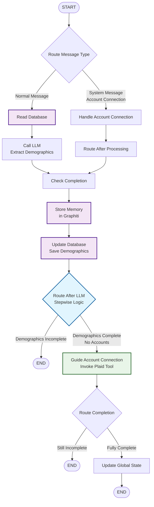
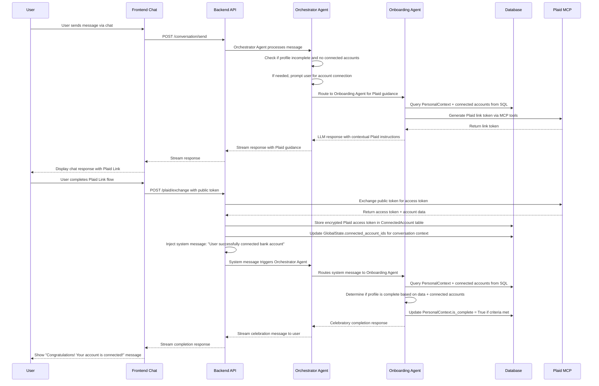

# Story 2.1a: Essential Onboarding Setup

## Status

In Progress

## Story

**As a** user,
**I want** to complete essential setup information to start using the app immediately,
**so that** I can access core functionality while the AI learns my preferences over time.

## Acceptance Criteria

**Essential Information Capture:**
1. Conversational onboarding flow guided by LangGraph Onboarding Agent with progress awareness
2. Natural language extraction of demographic data into PersonalContextModel (age_range, marital_status, has_dependents)
3. LLM-guided account connection process with contextual explanations and Plaid Link integration
4. Clear "Ready to Use" completion state achieved only after successful Plaid account connection, communicated conversationally and reflected in app functionality
5. Conversation state persistence across sessions using LangGraph checkpointing and SQLite storage

**Technical Implementation (references architecture/data-models.md):**
6. PersonalContextModel creation and SQLite persistence for structured data
7. LangGraph Onboarding Agent initialization with user context
8. Integration with existing authentication system and user profile
9. Wizard completion triggers PersonalContext.is_complete = True update ONLY after Plaid account linking succeeds

**User Experience:**
10. Conversational completion celebration and seamless transition to main app
11. Clear conversational indication that ongoing learning will enhance recommendations  
12. Natural language ability to modify essential information through conversational profile updates

**Dependencies:** Requires completion of Epic 1 authentication and MCP server foundation, AND Story 2.0 (LLM Provider Integration & Agent Foundation) for LangGraph orchestration and LLM capabilities.

## Tasks / Subtasks

### Implementation Tasks (Feature-Based for Incremental Shipping)

#### ✅ Foundation Complete
- [x] PersonalContext database model and migration (AC: 6)
- [x] LangGraph Onboarding Agent implementation (AC: 1, 7)
- [x] Conversation state persistence (AC: 5)

#### 🚀 Feature 1: Plaid Integration in Conversation (AC: 3, 9)
- [ ] Backend: Orchestrator guidance for account connection
  - [x] Add Onboarding agent logic to prompt users for account connection when profile incomplete
  - [x] Route to OnboardingAgent for Plaid Link guidance and contextual explanations
  - [x] Integrate existing plaid_create_link_token MCP tool from Story 1.6 within OnboardingAgent
  - [x] Create token exchange API endpoint for public token → access token conversion
  - [x] Add Plaid Link token response handling in OnboardingAgent conversation flow
  - [x] Add system message injection to token exchange endpoint for conversation resumption
  - [x] Update OnboardingAgent to handle account connection system messages and completion updates
  - [x] Implement conversation state updates after successful account connection
  - [x] Implement ConnectedAccount SQL model for secure storage of encrypted Plaid access tokens
  - [x] Add account CRUD operations in database.py for persistent storage
  - [x] Update GlobalState with lightweight connected_account_ids for conversation context
  - [x] Create shared PlaidMCPClient to refactor _get_mcp_client from SpendingAgent
  - [x] Refactor SpendingAgent to use new PlaidMCPClient
  - [x] Refactor test_spending_agent_real_mcp.py to use PlaidMCPClient
- [ ] Frontend: Plaid Link within orchestrator conversation flow
  - [ ] Add PlaidConnect component for guided account connection via orchestrator
  - [ ] Handle Plaid Link token from orchestrator conversation stream
  - [ ] Implement react-plaid-link integration with token exchange flow
  - [ ] Add account connection success handling in existing chat interface
  - [ ] Update RTK Query plaidApi with token exchange endpoints
  - [ ] Handle conversation resumption after account connection completion

#### 🚀 Feature 2: Profile Completion Logic (AC: 8, 9)
- [ ] Onboarding Agent completion detection and management using PersonalContext.is_complete
  - [ ] Add is_complete boolean field to PersonalContext model as single source of truth
  - [ ] Implement completion logic based on PersonalContext data completeness + connected accounts
  - [ ] Onboarding Agent determines PersonalContext.is_complete status from actual data, not manual flags
  - [ ] Frontend notifies Onboarding Agent after Plaid link completion via conversation
  - [ ] Onboarding Agent handles celebratory completion messaging and PersonalContext.is_complete update

#### 🚀 Feature 3: Profile Data Display (AC: 4, 8)
- [ ] Backend: PersonalContext REST endpoints
  - [ ] Create GET /api/profile/personal-context endpoint to expose PersonalContext data
  - [ ] Add GET /api/profile/completion-status endpoint for profile completion tracking
- [ ] Frontend: Profile display functionality
  - [ ] Create profile display component to show PersonalContext data via REST API
  - [ ] Add RTK Query endpoints for PersonalContext REST endpoints
  - [ ] Display profile completeness and connected accounts status from backend

### Integration & Testing
- [x] Implement conversation state persistence (AC: 5)
  - [x] Configure LangGraph SQLite checkpointer for conversation state
  - [x] Test conversation continuation across browser sessions
- [x] Add comprehensive testing coverage
  - [x] Unit tests for OnboardingAgent conversation logic (21/21 tests passing)
  - [ ] Frontend component tests for onboarding flow
  - [x] Integration tests for complete onboarding workflow (15/15 real API tests passing)
- [ ] Profile modification capability (AC: 12)
  - [ ] Add conversational profile update endpoints
  - [ ] Implement natural language profile information editing

## Dev Notes

### Previous Story Insights
From Story 1.6 completion:
- Plaid MCP integration fully implemented with create_link_token, exchange_public_token, get_accounts tools
- MCP server integrated with FastMCP v2.12.0 and available at /mcp endpoint
- JWT authentication system ready for user context in agents
- PlaidService abstraction layer provides clean API for agent tool access

From Story 2.0 foundation (prerequisite):
- LLM providers configured with API key management (OpenAI/Anthropic)
- LangGraph GlobalState pattern implemented for agent coordination  
- Orchestrator Agent with LLM-powered intent routing established
- Core conversation endpoints (/api/conversation/send) with streaming support
- MCP client integrated with GlobalState for cross-agent tool access

### Data Models
**PersonalContext Model** [Source: architecture/data-models.md#personal-context-models]:
```python
@dataclass
class PersonalContext:
    age_range: Optional[AgeRange] = None
    life_stage: Optional[LifeStage] = None
    occupation_type: Optional[str] = None
    location_context: Optional[str] = None
    family_structure: Optional[FamilyStructure] = None
    marital_status: Optional[MaritalStatus] = None
    spouse_info: Optional[SpouseBasicInfo] = None
    dependents: List[Dependent] = field(default_factory=list)
    total_dependents_count: int = 0
    children_count: int = 0
    caregiving_responsibilities: List[CaregivingResponsibility] = field(default_factory=list)

    # Completion tracking - single source of truth [Story 2.1a extension]
    is_complete: bool = False  # True only after demographic data + Plaid account linking
```

**ConnectedAccount Model** [New for Story 2.1a Feature 1]:
```python
class ConnectedAccount(SQLModel, table=True):
    id: Optional[int] = Field(primary_key=True)
    user_id: str = Field(foreign_key="user.id")
    plaid_account_id: str
    encrypted_access_token: str
    account_name: str
    account_type: str
    created_at: datetime
```

**User Model** [Source: architecture/data-models.md#core-user-model]:
- No changes needed to User model - PersonalContext model handles all demographic data and completion tracking
- PersonalContext.is_complete serves as single source of truth for profile completion
- PersonalContext has separate table with foreign key to User
- ConnectedAccount has separate table with foreign key to User for secure token storage

### LangGraph Agent Architecture
**Onboarding Agent Implementation** [Source: architecture/components.md#ai-conversation-service]:
- Integrate with existing GlobalState pattern for shared conversation state
- Use MCP client for Plaid tool access (create_link_token, exchange_public_token)
- Implement demographic extraction with LLM validation against PersonalContext enums
- Store structured data in PersonalContext model, conversation context in LangGraph checkpointer

**Onboarding Agent Internal Graph Flow**:


**Key Improvements in Current Implementation:**
- **Stepwise Logic**: Demographics must be complete before account connection
- **Data Safety**: Always save demographics before attempting Plaid tool
- **Two Account Flows**: Proactive (guide_account_connection) vs Reactive (handle_account_connection)
- **Error Recovery**: If Plaid tool fails, demographic data is already persisted

**Global State Integration** [Source: architecture/components.md#global-state-management]:
```python
class GlobalState(BaseModel):
    user_id: str
    session_id: str
    conversation_history: List[Dict[str, Any]]
    user_message: str
    user_profile: Optional[Dict[str, Any]] = None
    connected_account_ids: List[str] = []  # Lightweight references for conversation context
```

### API Specifications
**Conversation Endpoints** [Source: architecture/components.md#ai-conversation-service]:
- POST /api/conversation/send - Orchestrator agent handles all conversations and routes to onboarding agent when needed
- No separate onboarding endpoint - orchestrator manages routing
- Integration with JWT authentication for user context

**PersonalContext REST Endpoints**:
- GET /api/profile/personal-context - Retrieve user's PersonalContext data
- GET /api/profile/completion-status - Check profile completion status

### Frontend Architecture
**Frontend Components**:
- Uses existing chat interface - no separate onboarding components needed
- ProfileDisplay component: `frontend/src/components/profile/ProfileDisplay/`
- Uses AI-SDK useChat hook for streaming conversation interface with orchestrator
- Integration with RTK Query for PersonalContext REST endpoints
- PlaidConnect component for guided account connection within chat flow

**Conversation Flow** (Updated for Orchestrator-Only Architecture):


### File Locations
**Backend Files** [Source: architecture/unified-project-structure.md]:
- PersonalContext model: `backend/app/models/user.py`
- Onboarding Agent: `backend/app/ai/onboarding_agent.py` 
- Conversation router: `backend/app/routers/conversation.py`
- AI service integration: `backend/app/services/ai_service.py`

**Frontend Files**:
- Profile display components: `frontend/src/components/profile/ProfileDisplay/`
- Profile API: `frontend/src/store/api/profileApi.ts`
- Conversation API: `frontend/src/store/api/conversationApi.ts` (existing)

### Technical Constraints
- **Technology Stack**: LangGraph 0.0.x with SQLite checkpointing for conversation persistence [Source: architecture/tech-stack.md]
- **Authentication**: Integration with existing Google OAuth + JWT system [Source: architecture/tech-stack.md]  
- **State Management**: Redux Toolkit with RTK Query for API integration [Source: architecture/tech-stack.md]
- **AI Framework**: AI-SDK 2.2.x for React streaming conversation interface [Source: architecture/tech-stack.md]

### Security Requirements
- JWT token validation for all conversation endpoints [Source: architecture/security-and-performance.md#authentication-security]
- PersonalContext data encryption at rest for PII protection [Source: architecture/security-and-performance.md#financial-data-security]
- Plaid access tokens must be securely stored in SQLite DB with encryption for POC [Source: Epic 2.1a AC #9]
- No sensitive data logged in conversation flows [Source: architecture/security-and-performance.md#backend-security]

### Testing

**Testing Standards from Architecture** [Source: architecture/testing-strategy.md]:

**Test Framework**: pytest with pytest-asyncio for backend async tests, Jest + Testing Library for frontend
**Test Location**: `backend/tests/` for backend, `frontend/src/components/__tests__/` for components
**Test File Naming**: `test_*.py` for backend, `*.test.tsx` for frontend components

**Specific Testing Requirements for This Story**:
1. **Extend test_onboarding_agent_unit.py**: Add completion detection logic and PersonalContext.is_complete updates
2. **Extend test_user_models.py**: Add PersonalContext model validation, enum handling, and is_complete field tests
3. **Extend test_conversation_endpoints.py**: Add PersonalContext REST endpoints (GET/PUT personal-context, GET completion-status)
4. **Extend test_integration_real_api.py**: Add complete onboarding workflow with PersonalContext.is_complete updates and Plaid completion flow
5. **New ProfileDisplay.test.tsx**: Frontend component tests for profile display using REST endpoints
6. **New ProfileCompletion.test.tsx**: Frontend component tests for completion status display

**Test Organization** (Using Existing Test Files):
```text
backend/tests/
├── test_onboarding_agent_unit.py     # EXISTING - extend with completion detection logic
├── test_user_models.py                # EXISTING - extend with PersonalContext.is_complete tests
├── test_conversation_endpoints.py     # EXISTING - extend with PersonalContext REST endpoints
└── test_integration_real_api.py      # EXISTING - extend with PersonalContext completion workflow

frontend/src/components/__tests__/
└── profile/
    ├── ProfileDisplay.test.tsx    # NEW - Profile display component using REST endpoints
    └── ProfileCompletion.test.tsx # NEW - Completion status display
```

## Change Log

| Date | Version | Description | Author |
|------|---------|-------------|--------|
| 2025-09-04 | 1.0 | Initial story creation with comprehensive context from Epic 2.1a | SM Agent |
| 2025-09-17 | 2.0 | Major architectural updates: orchestrator-only conversations, PersonalContext REST endpoints, feature-based incremental shipping structure | SM Agent |
| 2025-09-17 | 2.1 | Updated to use PersonalContext.is_complete as single source of truth for completion state (dual-storage architecture alignment) | SM Agent |
| 2025-09-17 | 2.2 | Updated test organization to reuse existing test files, corrected mermaid diagram syntax and flow, aligned Epic 2 requirements | SM Agent |
| 2025-09-18 | 2.3 | Removed Feature 2 (completed by Story 2.0), reordered features to prioritize Plaid Integration and Profile Completion Logic | SM Agent |

## Dev Agent Record

### Agent Model Used
*To be populated during implementation*

### Debug Log References
*To be populated during implementation*

### Completion Notes List
**Backend OnboardingAgent Implementation Completed (September 8, 2025)**:
- ✅ PersonalContext Data Model: Complete restructure to match architecture/data-models.md with proper enums (AgeRange, LifeStage, MaritalStatus, FamilyStructure) and structured fields (SpouseBasicInfoModel, DependentModel)
- ✅ OnboardingAgent LangGraph Subgraph: Full implementation with proper node flow (start → read_db → call_llm → update_db → check_completion → update_main_graph/complete)
- ✅ ProfileDataExtraction: OpenAI structured output with comprehensive field extraction and validation
- ✅ Database Integration: PersonalContext CRUD operations with proper SQLModel/SQLAlchemy persistence
- ✅ Critical Bug Fix: Resolved branching logic flaw where completed profiles would skip database updates
- ✅ LangGraph Checkpointing: SQLite conversation persistence with proper state management
- ✅ Profile Context Integration: Automated profile context building and injection into main graph for personalized responses
- ✅ Comprehensive Testing: 21/21 unit tests + 15/15 real API integration tests with database isolation fixtures
- ✅ End-to-End Workflow: Verified complete onboarding flow with profile extraction, completion detection, and orchestrator routing
- ✅ Legacy Data Migration: Clean removal of JSON profile_data field in favor of structured PersonalContext model

**MCP Tool Integration Refactoring (September 24, 2025)**:
- ✅ Removed redundant `_create_plaid_link_tool` wrapper function from OnboardingAgent
- ✅ Refactored OnboardingAgent to use direct MCP tool binding via `get_tool_by_name()`
- ✅ Cleaned up tool binding logic - removed unnecessary tool binding from `_call_llm` (demographics only)
- ✅ Updated tests to handle async `_call_llm` method with proper await calls
- ✅ Fixed SpendingAgent test expectations for MCP tool parameter consistency
- ✅ Simplified OnboardingAgent graph by removing redundant conditional edge and unused `_route_after_processing` method
- ✅ Consistent MCP tool usage pattern: OnboardingAgent uses tools only in `_guide_account_connection`, SpendingAgent uses direct MCP calls

### File List
**Core Implementation Files:**
- `backend/app/ai/onboarding.py` - Complete OnboardingAgent with LangGraph subgraph architecture, refactored MCP tool integration, simplified graph routing
- `backend/app/core/sqlmodel_models.py` - Updated PersonalContext model with proper data structure and ConnectedAccount model for Plaid integration
- `backend/app/ai/orchestrator_agent.py` - Updated GlobalState integration and profile context methods with connected_account_ids
- `backend/app/core/database.py` - PersonalContext and ConnectedAccount CRUD operations with async/sync compatibility
- `backend/app/ai/spending_agent.py` - Refactored to use shared PlaidMCPClient instead of embedded _get_mcp_client method
- `backend/app/ai/mcp_clients/plaid_client.py` - New shared PlaidMCPClient with per-user JWT authentication and generic tool calling
- `backend/app/ai/mcp_clients/__init__.py` - Updated to export get_plaid_client function

**Test Files:**
- `backend/tests/test_onboarding_agent_unit.py` - Updated unit tests with async/await for `_call_llm` calls, added PlaidMCPClient mocking
- `backend/tests/test_spending_agent.py` - Fixed test expectations for MCP tool parameter consistency
- `backend/tests/test_integration_real_api.py` - 15 real API integration tests with database isolation
- `backend/tests/conftest.py` - Updated pytest fixtures for database cleanup and LLM mocking
- `backend/test_spending_agent_real_mcp.py` - Refactored to use shared PlaidMCPClient for integration testing

## QA Results
*To be populated after implementation*