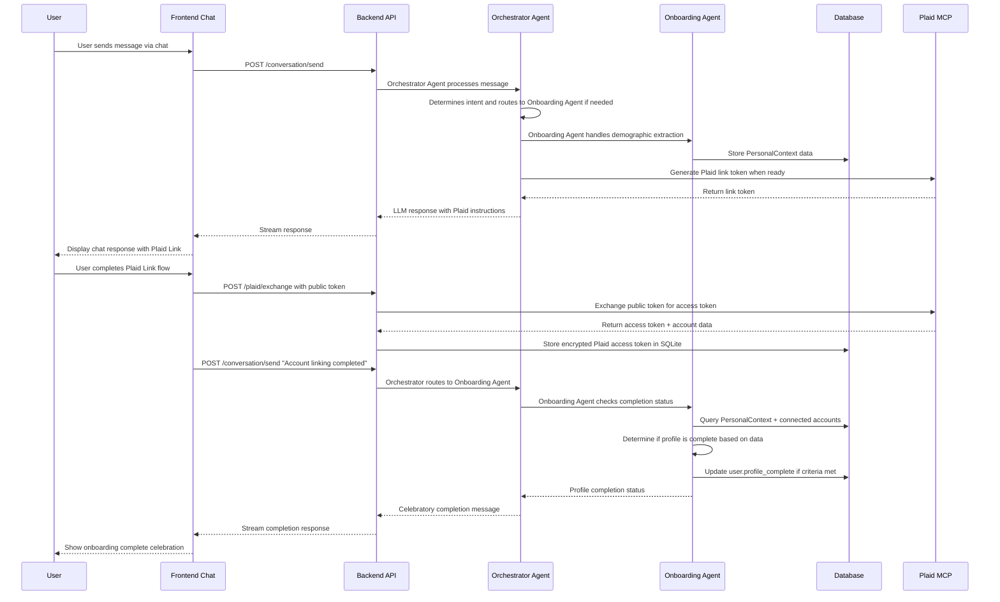

# Story 2.1a: Essential Onboarding Setup

## Status

In Progress

## Story

**As a** user,
**I want** to complete essential setup information to start using the app immediately,
**so that** I can access core functionality while the AI learns my preferences over time.

## Acceptance Criteria

**Essential Information Capture:**
1. Conversational onboarding flow guided by LangGraph Onboarding Agent with progress awareness
2. Natural language extraction of demographic data into PersonalContextModel (age_range, marital_status, has_dependents)
3. LLM-guided account connection process with contextual explanations and Plaid Link integration
4. Clear "Ready to Use" completion state achieved only after successful Plaid account connection, communicated conversationally and reflected in app functionality
5. Conversation state persistence across sessions using LangGraph checkpointing and SQLite storage

**Technical Implementation (references architecture/data-models.md):**
6. PersonalContextModel creation and SQLite persistence for structured data
7. LangGraph Onboarding Agent initialization with user context
8. Integration with existing authentication system and user profile
9. Wizard completion triggers user.profile_complete = True update ONLY after Plaid account linking succeeds

**User Experience:**
10. Conversational completion celebration and seamless transition to main app
11. Clear conversational indication that ongoing learning will enhance recommendations  
12. Natural language ability to modify essential information through conversational profile updates

**Dependencies:** Requires completion of Epic 1 authentication and MCP server foundation, AND Story 2.0 (LLM Provider Integration & Agent Foundation) for LangGraph orchestration and LLM capabilities.

## Tasks / Subtasks

### Implementation Tasks (Feature-Based for Incremental Shipping)

#### ✅ Foundation Complete
- [x] PersonalContext database model and migration (AC: 6)
- [x] LangGraph Onboarding Agent implementation (AC: 1, 7)
- [x] Conversation state persistence (AC: 5)

#### 🚀 Feature 1: Profile Data Display (AC: 4, 8)
- [ ] Backend: PersonalContext REST endpoints
  - [ ] Create GET /api/profile/personal-context endpoint to expose PersonalContext data
  - [ ] Add GET /api/profile/completion-status endpoint for profile completion tracking
- [ ] Frontend: Profile display functionality
  - [ ] Create profile display component to show PersonalContext data via REST API
  - [ ] Add RTK Query endpoints for PersonalContext REST endpoints
  - [ ] Display profile completeness and connected accounts status from backend

#### 🚀 Feature 2: Orchestrator-Driven Onboarding Flow (AC: 1, 10, 11)
- [ ] Configure existing chat interface for orchestrator-driven onboarding
  - [ ] Users chat with orchestrator agent, which routes to onboarding agent when needed
  - [ ] No separate onboarding conversation mode - all through existing chat interface
  - [ ] Implement seamless transition to main app upon profile completion

#### 🚀 Feature 3: Plaid Integration in Conversation (AC: 3, 9)
- [ ] Backend: Plaid Link flow within orchestrator conversation
  - [ ] Add guided Plaid Link instructions via orchestrator agent routing to onboarding agent
  - [ ] Create contextual explanations for account connection benefits
  - [ ] Integrate existing plaid_create_link_token MCP tool from Story 1.6
  - [ ] Implement secure storage of Plaid access tokens in SQLite DB for POC
- [ ] Frontend: Plaid Link within orchestrator conversation flow
  - [ ] Add PlaidConnect component for guided account connection via orchestrator
  - [ ] Handle Plaid Link token from orchestrator conversation stream
  - [ ] Implement account connection success handling in existing chat interface

#### 🚀 Feature 4: Profile Completion Logic (AC: 8, 9)
- [ ] Onboarding Agent completion detection and management
  - [ ] Implement completion logic based on PersonalContext completeness + connected accounts
  - [ ] Onboarding Agent determines profile_complete status from actual data, not manual flags
  - [ ] Frontend notifies Onboarding Agent after Plaid link completion via conversation
  - [ ] Onboarding Agent handles celebratory completion messaging and profile_complete update

### Integration & Testing
- [x] Implement conversation state persistence (AC: 5)
  - [x] Configure LangGraph SQLite checkpointer for conversation state
  - [x] Test conversation continuation across browser sessions
- [x] Add comprehensive testing coverage
  - [x] Unit tests for OnboardingAgent conversation logic (21/21 tests passing)
  - [ ] Frontend component tests for onboarding flow
  - [x] Integration tests for complete onboarding workflow (15/15 real API tests passing)
- [ ] Profile modification capability (AC: 12)
  - [ ] Add conversational profile update endpoints
  - [ ] Implement natural language profile information editing

## Dev Notes

### Previous Story Insights
From Story 1.6 completion:
- Plaid MCP integration fully implemented with create_link_token, exchange_public_token, get_accounts tools
- MCP server integrated with FastMCP v2.12.0 and available at /mcp endpoint
- JWT authentication system ready for user context in agents
- PlaidService abstraction layer provides clean API for agent tool access

From Story 2.0 foundation (prerequisite):
- LLM providers configured with API key management (OpenAI/Anthropic)
- LangGraph GlobalState pattern implemented for agent coordination  
- Orchestrator Agent with LLM-powered intent routing established
- Core conversation endpoints (/api/conversation/send) with streaming support
- MCP client integrated with GlobalState for cross-agent tool access

### Data Models
**PersonalContext Model** [Source: architecture/data-models.md#personal-context-models]:
```python
@dataclass
class PersonalContext:
    age_range: Optional[AgeRange] = None
    life_stage: Optional[LifeStage] = None
    occupation_type: Optional[str] = None
    location_context: Optional[str] = None
    family_structure: Optional[FamilyStructure] = None
    marital_status: Optional[MaritalStatus] = None
    spouse_info: Optional[SpouseBasicInfo] = None
    dependents: List[Dependent] = field(default_factory=list)
    total_dependents_count: int = 0
    children_count: int = 0
    caregiving_responsibilities: List[CaregivingResponsibility] = field(default_factory=list)
```

**User Model** [Source: architecture/data-models.md#core-user-model]:
- No changes needed to User model - PersonalContext model handles all demographic data
- Existing user.profile_complete boolean field tracks completion status
- PersonalContext has separate table with foreign key to User

### LangGraph Agent Architecture
**Onboarding Agent Implementation** [Source: architecture/components.md#ai-conversation-service]:
- Integrate with existing GlobalState pattern for shared conversation state
- Use MCP client for Plaid tool access (create_link_token, exchange_public_token)
- Implement demographic extraction with LLM validation against PersonalContext enums
- Store structured data in PersonalContext model, conversation context in LangGraph checkpointer

**Global State Integration** [Source: architecture/components.md#global-state-management]:
```python
class GlobalState(BaseModel):
    user_id: str
    session_id: str
    conversation_history: List[Dict[str, Any]]
    user_message: str
    user_profile: Optional[Dict[str, Any]] = None
    connected_accounts: List[Dict[str, Any]] = []
```

### API Specifications
**Conversation Endpoints** [Source: architecture/components.md#ai-conversation-service]:
- POST /api/conversation/send - Orchestrator agent handles all conversations and routes to onboarding agent when needed
- No separate onboarding endpoint - orchestrator manages routing
- Integration with JWT authentication for user context

**PersonalContext REST Endpoints**:
- GET /api/profile/personal-context - Retrieve user's PersonalContext data
- GET /api/profile/completion-status - Check profile completion status

### Frontend Architecture
**Frontend Components**:
- Uses existing chat interface - no separate onboarding components needed
- ProfileDisplay component: `frontend/src/components/profile/ProfileDisplay/`
- Uses AI-SDK useChat hook for streaming conversation interface with orchestrator
- Integration with RTK Query for PersonalContext REST endpoints
- PlaidConnect component for guided account connection within chat flow

**Conversation Flow** (Updated for Orchestrator-Only Architecture):


### File Locations
**Backend Files** [Source: architecture/unified-project-structure.md]:
- PersonalContext model: `backend/app/models/user.py`
- Onboarding Agent: `backend/app/ai/onboarding_agent.py` 
- Conversation router: `backend/app/routers/conversation.py`
- AI service integration: `backend/app/services/ai_service.py`

**Frontend Files**:
- Profile display components: `frontend/src/components/profile/ProfileDisplay/`
- Profile API: `frontend/src/store/api/profileApi.ts`
- Conversation API: `frontend/src/store/api/conversationApi.ts` (existing)

### Technical Constraints
- **Technology Stack**: LangGraph 0.0.x with SQLite checkpointing for conversation persistence [Source: architecture/tech-stack.md]
- **Authentication**: Integration with existing Google OAuth + JWT system [Source: architecture/tech-stack.md]  
- **State Management**: Redux Toolkit with RTK Query for API integration [Source: architecture/tech-stack.md]
- **AI Framework**: AI-SDK 2.2.x for React streaming conversation interface [Source: architecture/tech-stack.md]

### Security Requirements
- JWT token validation for all conversation endpoints [Source: architecture/security-and-performance.md#authentication-security]
- PersonalContext data encryption at rest for PII protection [Source: architecture/security-and-performance.md#financial-data-security]
- Plaid access tokens must be securely stored in SQLite DB with encryption for POC [Source: Epic 2.1a AC #9]
- No sensitive data logged in conversation flows [Source: architecture/security-and-performance.md#backend-security]

### Testing

**Testing Standards from Architecture** [Source: architecture/testing-strategy.md]:

**Test Framework**: pytest with pytest-asyncio for backend async tests, Jest + Testing Library for frontend
**Test Location**: `backend/tests/` for backend, `frontend/src/components/__tests__/` for components
**Test File Naming**: `test_*.py` for backend, `*.test.tsx` for frontend components

**Specific Testing Requirements for This Story**:
1. Unit tests for OnboardingAgent conversation logic with mocked LLM responses
2. Unit tests for PersonalContext model validation and enum handling
3. Frontend component tests for AIConversation onboarding flow
4. Integration tests for complete onboarding workflow with state persistence
5. API tests for conversation endpoints with JWT authentication

**Test Organization** [Source: architecture/testing-strategy.md#test-organization]:
```text
backend/tests/
├── test_onboarding_agent.py      # Onboarding Agent logic
├── test_personal_context.py      # PersonalContext model
└── integration/
    └── test_onboarding_flow.py   # End-to-end onboarding

frontend/src/components/__tests__/
└── onboarding/
    ├── AIConversation.test.tsx
    └── OnboardingFlow.test.tsx
```

## Change Log

| Date | Version | Description | Author |
|------|---------|-------------|--------|
| 2025-09-04 | 1.0 | Initial story creation with comprehensive context from Epic 2.1a | SM Agent |

## Dev Agent Record

### Agent Model Used
*To be populated during implementation*

### Debug Log References
*To be populated during implementation*

### Completion Notes List
**Backend OnboardingAgent Implementation Completed (September 8, 2025)**:
- ✅ PersonalContext Data Model: Complete restructure to match architecture/data-models.md with proper enums (AgeRange, LifeStage, MaritalStatus, FamilyStructure) and structured fields (SpouseBasicInfoModel, DependentModel)
- ✅ OnboardingAgent LangGraph Subgraph: Full implementation with proper node flow (start → read_db → call_llm → update_db → check_completion → update_main_graph/complete)
- ✅ ProfileDataExtraction: OpenAI structured output with comprehensive field extraction and validation
- ✅ Database Integration: PersonalContext CRUD operations with proper SQLModel/SQLAlchemy persistence
- ✅ Critical Bug Fix: Resolved branching logic flaw where completed profiles would skip database updates
- ✅ LangGraph Checkpointing: SQLite conversation persistence with proper state management
- ✅ Profile Context Integration: Automated profile context building and injection into main graph for personalized responses
- ✅ Comprehensive Testing: 21/21 unit tests + 15/15 real API integration tests with database isolation fixtures
- ✅ End-to-End Workflow: Verified complete onboarding flow with profile extraction, completion detection, and orchestrator routing
- ✅ Legacy Data Migration: Clean removal of JSON profile_data field in favor of structured PersonalContext model

### File List
**Core Implementation Files:**
- `backend/app/ai/onboarding.py` - Complete OnboardingAgent with LangGraph subgraph architecture
- `backend/app/core/sqlmodel_models.py` - Updated PersonalContext model with proper data structure
- `backend/app/ai/langgraph_config.py` - Updated GlobalState integration and profile context methods
- `backend/app/core/database.py` - PersonalContext CRUD operations and legacy data cleanup

**Test Files:**
- `backend/tests/test_onboarding_agent.py` - 21 comprehensive unit tests with full mocking
- `backend/tests/test_integration_real_api.py` - 15 real API integration tests with database isolation
- `backend/tests/conftest.py` - Updated pytest fixtures for database cleanup and LLM mocking

## QA Results
*To be populated after implementation*